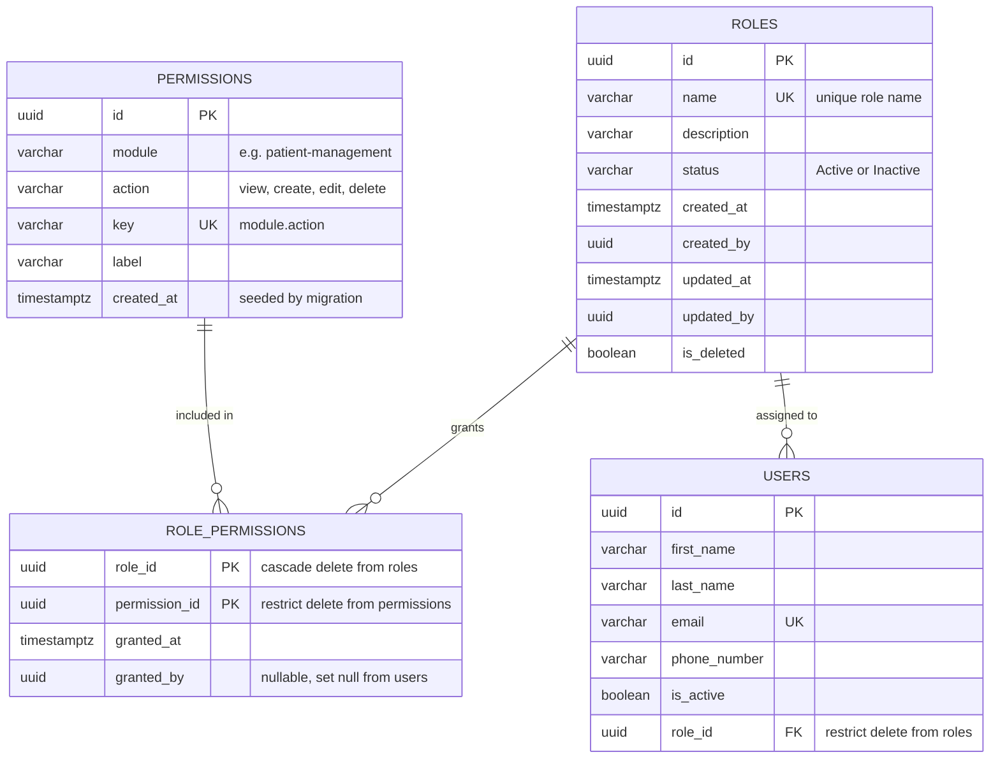

# Database Schema — Roles & Permissions

Normalized RBAC schema for the `identity` module: the tables, columns, and constraints needed to back the existing Roles Management UI. Companion to [Authorization.md](Authorization.md) (API contract this schema backs) and [DatabaseArchitecture.md](DatabaseArchitecture.md) (the naming/PK/audit conventions this schema follows).

**Scope:** 3 new tables (`permissions`, `roles`, `role_permissions`) plus 1 new column (`role_id`) on the existing `users` table. All in the `identity` schema.

---

## ER Diagram

Solid crow's-foot = required relationship. `role_permissions` is a pure bridge table owned by the Role aggregate, not an independent aggregate root.

---

## Key decisions

- **One role per user, not many-to-many** — `users.role_id` is a single FK, matching what's already documented in [Authorization.md](Authorization.md). Revisit only if a real "multiple roles per user" requirement shows up.
- **`permissions` is lean reference data** (no soft-delete, no `updated_by`) — it's seeded by migration, never edited through the UI. The standard audit column set in `Entity.cs` is for user-managed aggregate roots; a static 40-row catalog doesn't need it.
- **`roles` carries the full audit set** (`created_by`/`updated_by`/`is_deleted`/`deleted_by`) since it's a user-managed aggregate root, edited via the Roles UI.
- **`role_permissions` → `roles` is `ON DELETE CASCADE`** — the grant has no meaning without its role (textbook parent-owns-child case per `DatabaseArchitecture.md` §7). **`role_permissions` → `permissions`** and **`users` → `roles`** are `ON DELETE RESTRICT` — the default posture, so a role in use can't be silently deleted out from under its users.
- **`users.role_id` should land nullable** in the first migration (existing users have none yet), get backfilled, then a follow-up migration can decide whether to enforce `NOT NULL`.
- **Concurrency token:** use PostgreSQL's built-in `xmin` system column rather than adding an explicit `row_version` column, per `DatabaseArchitecture.md` §5.

---

## `identity.permissions` — new table, reference data

Fixed catalog of module × action pairs. Seeded once via migration — not created, edited, or deleted through any UI.

| Column | Type | Null | Default | Notes |
|---|---|---|---|---|
| `id` **PK** | uuid | not null | — | Generated app-side (sequential UUID), per project PK standard. |
| `module` | varchar(64) | not null | — | e.g. `patient-management`. Must match `features/roles/modules.ts` exactly. |
| `action` | varchar(16) | not null | — | `view` / `create` / `edit` / `delete` — enforced by `ck_permissions_action`. |
| `key` **UK** | varchar(96) | not null | — | `{module}.{action}`, e.g. `patient-management.view`. |
| `label` | varchar(32) | not null | — | Display text: "View", "Create", "Edit", "Delete". |
| `created_at` | timestamptz | not null | `now()` | Seed timestamp only — this table has no ongoing write path. |

---

## `identity.roles` — new table, aggregate root

User-managed. Full audit set from the shared `Entity` base class.

| Column | Type | Null | Default | Notes |
|---|---|---|---|---|
| `id` **PK** | uuid | not null | — | Sequential UUID, app-generated. |
| `name` **UK** | varchar(100) | not null | — | `ux_roles_name` — enforces uniqueness, backs the 409 on duplicate create. |
| `description` | varchar(500) | null | — | Free text, shown in the list page's Description column. |
| `status` | varchar(16) | not null | `'Active'` | `Active` / `Inactive` — `ck_roles_status`. Backs the list page's status filter. |
| `created_at` | timestamptz | not null | `now()` | — |
| `created_by` **FK** | uuid | null | — | → `identity.users.id`. Nullable — first roles may be seeded, not created by a user. |
| `updated_at` | timestamptz | null | — | — |
| `updated_by` **FK** | uuid | null | — | → `identity.users.id` |
| `is_deleted` | boolean | not null | `false` | Soft-delete flag — filtered globally at the EF Core `DbContext` level. |
| `deleted_at` | timestamptz | null | — | — |
| `deleted_by` **FK** | uuid | null | — | → `identity.users.id` |

---

## `identity.role_permissions` — new table, bridge

Owned by the Role aggregate — not its own aggregate root, so it skips the full audit set and just tracks the grant itself.

| Column | Type | Null | Default | Notes |
|---|---|---|---|---|
| `role_id` **PK, FK** | uuid | not null | — | → `identity.roles.id`, **ON DELETE CASCADE**. Part of the composite PK. |
| `permission_id` **PK, FK** | uuid | not null | — | → `identity.permissions.id`, **ON DELETE RESTRICT**. Part of the composite PK. |
| `granted_at` | timestamptz | not null | `now()` | — |
| `granted_by` **FK** | uuid | null | — | → `identity.users.id`, **ON DELETE SET NULL**. |

On every role save, the API replaces the full set of rows for that `role_id` in one transaction — matching the "grid + one Save button" UI. No per-permission attach/detach endpoint needed.

---

## `identity.users` — existing table, 1 column added

Existing columns shown for context; only `role_id` is new.

| Column | Type | Null | Default | Notes |
|---|---|---|---|---|
| `id` **PK** | uuid | not null | — | Existing. |
| `first_name` | varchar(120) | not null | — | Existing. |
| `last_name` | varchar(120) | not null | — | Existing. |
| `email` **UK** | varchar(255) | not null | — | Existing. |
| `phone_number` | varchar(32) | null | — | Existing. |
| `is_active` | boolean | not null | `true` | Existing. |
| **`role_id`** **FK** _(new)_ | uuid | null → not null* | — | → `identity.roles.id`, **ON DELETE RESTRICT**. *Land nullable, backfill, then tighten to `NOT NULL` in a follow-up migration. |

---

## Constraints & indexes checklist

Named per `DatabaseArchitecture.md` §3 conventions — hand this list directly to whoever writes the migration.

| Name | Table | Type | Definition |
|---|---|---|---|
| `pk_permissions` | permissions | Primary key | (id) |
| `ux_permissions_key` | permissions | Unique index | (key) |
| `ck_permissions_action` | permissions | Check | `action IN ('view','create','edit','delete')` |
| `pk_roles` | roles | Primary key | (id) |
| `ux_roles_name` | roles | Unique index | (name) |
| `ix_roles_status` | roles | Index | (status) — supports list-page filter |
| `ck_roles_status` | roles | Check | `status IN ('Active','Inactive')` |
| `pk_role_permissions` | role_permissions | Primary key | (role_id, permission_id) |
| `fk_role_permissions_roles` | role_permissions | Foreign key | role_id → roles.id, ON DELETE CASCADE |
| `fk_role_permissions_permissions` | role_permissions | Foreign key | permission_id → permissions.id, ON DELETE RESTRICT |
| `ix_role_permissions_permission_id` | role_permissions | Index | (permission_id) — required FK index + reverse lookups |
| `fk_users_roles` | users | Foreign key | role_id → roles.id, ON DELETE RESTRICT |
| `ix_users_role_id` | users | Index | (role_id) — required FK index |

---

## Permission catalog (40 seed rows)

The exact module × action grid `permissions` must be seeded with — mirrors the live UI's matrix precisely. Every module gets all 4 actions (`view`, `create`, `edit`, `delete`):

- `patient-management`
- `clinical-care`
- `diagnostics`
- `pharmacy`
- `support-services`
- `finance-billing`
- `records-compliance`
- `workforce-admin`
- `engagement`
- `reports-analytics`
