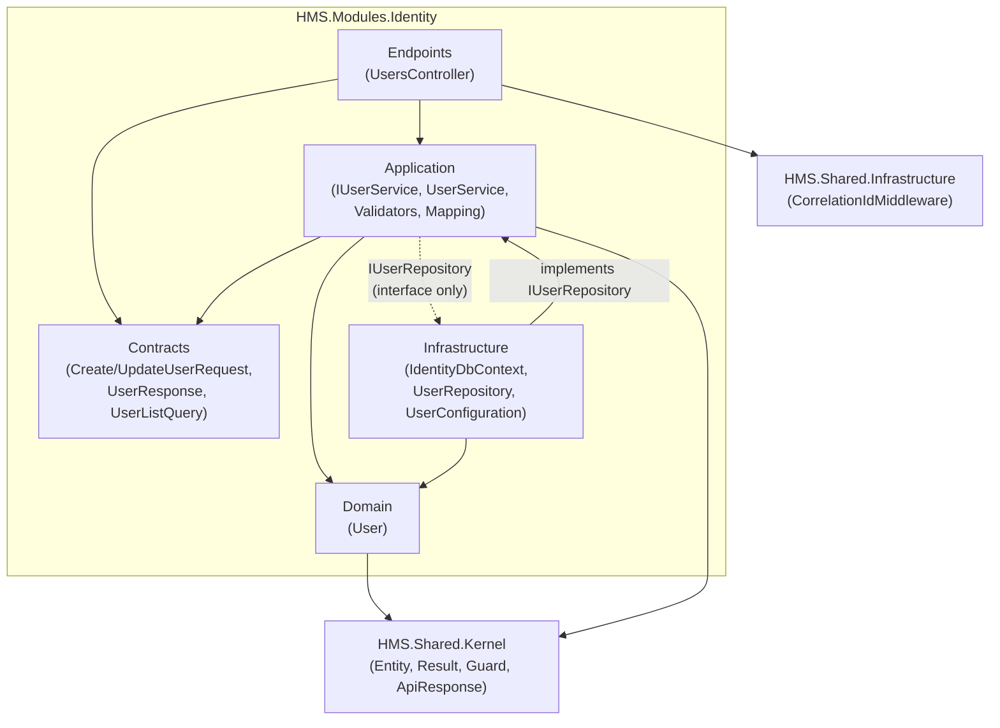
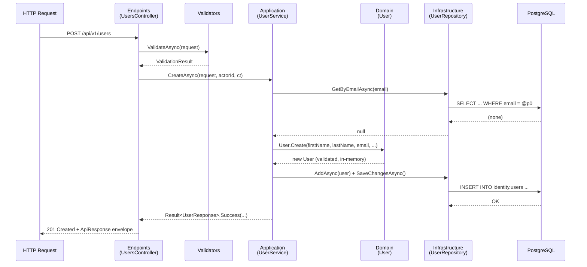
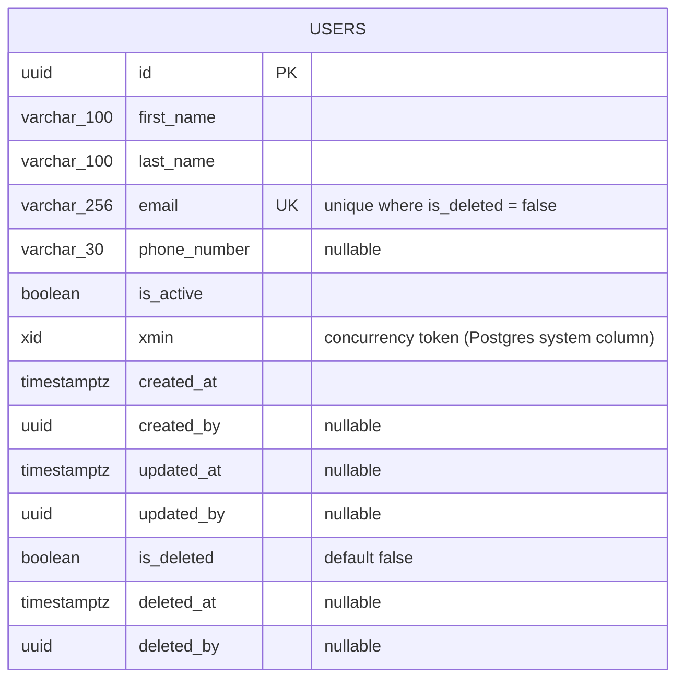
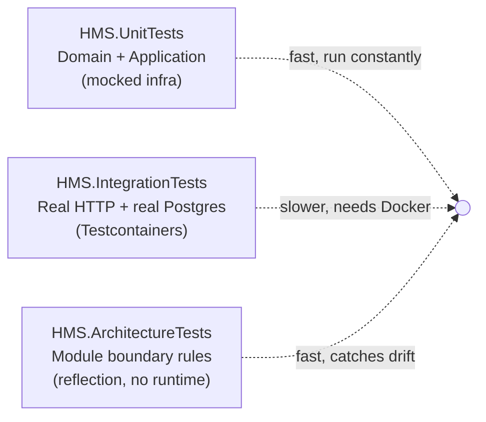
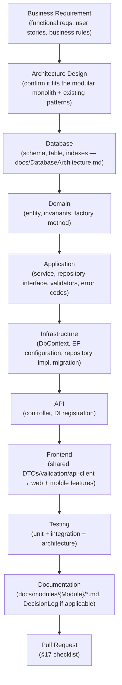

# HMS Developer Handbook

**The official development handbook for the Hospital Management System (HMS).**

This document explains, in depth, how the **Users module** (`HMS.Modules.Identity`) was built — every architectural decision, every layer, every convention, every mistake made and fixed along the way — so that every future module (Roles, Permissions, Patients, Staff, Appointments, Billing, Pharmacy, Laboratory, Inventory, ...) can be built the same way, by any developer, without needing to ask.

> **How to read this document:** it is long by design. Section 19 ("How to Create a New Module") is the fastest path to being productive; the rest is the reference material that section points back to. Read section 19 first if you just need to ship a module today. Read the whole thing if you want to understand *why* it works this way.

---

## Table of Contents

1. [Introduction](#1-introduction)
2. [Repository Overview](#2-repository-overview)
3. [Module Structure](#3-module-structure)
4. [Layer Responsibilities](#4-layer-responsibilities)
5. [Request Lifecycle](#5-request-lifecycle)
6. [Database Design](#6-database-design)
7. [Coding Standards](#7-coding-standards)
8. [Validation Strategy](#8-validation-strategy)
9. [Exception Handling](#9-exception-handling)
10. [Logging Strategy](#10-logging-strategy)
11. [Dependency Injection](#11-dependency-injection)
12. [Entity Framework](#12-entity-framework)
13. [API Standards](#13-api-standards)
14. [Frontend Integration](#14-frontend-integration)
15. [Testing Strategy](#15-testing-strategy)
16. [Development Workflow](#16-development-workflow)
17. [Pull Request Checklist](#17-pull-request-checklist)
18. [CI/CD Quality Gates](#18-cicd-quality-gates)
19. [How to Create a New Module](#19-how-to-create-a-new-module)
20. [Lessons Learned](#20-lessons-learned)
21. [Future Improvements](#21-future-improvements)

---

## 1. Introduction

### Purpose of this document

Every non-trivial codebase eventually needs a document that answers the question a new developer actually asks on day one: *"I need to build the Patients module — where do I even start, and how do I know I'm doing it the way the team expects?"* Before this document, the answer was scattered across ~20 standards documents in `docs/` (many of them still skeletal, see §2's note on documentation debt), the source code of one working module, and the memory of whoever built it.

This handbook consolidates all of that into one place, grounded entirely in a real, working, tested, end-to-end implementation — not aspirational guidelines. Every code example in this document is copied from, or is a direct simplification of, actual files in this repository. Where this document and an existing `docs/*.md` file disagree (a few do — see §20), this handbook reflects the **current, verified state of the code**, and the discrepancy is called out explicitly rather than silently papered over.

### Project overview

HMS (Hospital Management System) is a modular monolith backend (.NET 10 / C# / PostgreSQL / EF Core 10) with two frontend clients — a React web app (Vite) and a React Native mobile app (Expo) — sharing a platform-agnostic TypeScript library. The system is being built by a small team (one senior developer, two junior developers), which shapes almost every architectural decision in this document: prefer boring, well-understood technology over novel approaches; prefer one consistent pattern repeated across modules over "the best tool for each specific job"; prefer deferring complexity (event buses, microservices, multi-tenancy, caching layers) until it's actually needed, not before.

The domain is a hospital's administrative and clinical workflow, decomposed into modules:

| Module | Responsibility | Status |
|---|---|---|
| **Identity** | Users, roles, permissions, authentication-related records | **Built — reference implementation** |
| Patients | Patient demographic and registration records | Not yet built |
| Appointments | Scheduling — slots, bookings, calendars | Not yet built |
| Staff | Doctor/nurse/staff directory and roster data | Not yet built |
| Billing | Invoices, payments, billing line items | Not yet built |
| Notifications | Notification templates, delivery logs, reminders | Not yet built |
| Pharmacy, Laboratory, Inventory | Reserved schema names for post-MVP modules | Reserved, not built |

### Why the Users module was implemented first

The Users module was chosen as the first module for reasons that generalize to any project picking a "first" vertical slice:

1. **It is genuinely load-bearing but domain-simple.** Every other module eventually needs to know "who did this" (audit fields) and "who can see this" (future authorization). Building Users first means every subsequent module inherits a working identity record to reference, without Users itself needing to depend on anything else.
2. **It has no complex business rules to obscure the architecture.** A user has a name, an email, a phone number, and an active/inactive flag. This lets the *first* module prove out the folder structure, layering, DI wiring, validation strategy, error handling, EF Core conventions, API envelope shape, and frontend integration pattern — without a complicated domain also competing for attention. Get the *pattern* right first; complex domains (Appointments' scheduling conflicts, Billing's invoice math) are much easier to build correctly once the surrounding scaffolding is already proven.
3. **It deliberately excludes authentication.** Per `docs/modules/Identity/Users.md`, this iteration explicitly does *not* implement login, password hashes, JWTs, or authorization — see §21. That scope cut kept the first module small enough to actually finish end-to-end (backend, database, tests, both frontends) rather than stalling on the hardest, highest-risk feature (auth) before the basic pattern was even proven.

### Why this module is considered the reference implementation

Every convention in this handbook — the folder layout, the `internal`-by-default visibility rule, the `Result`/`Result<T>` error pattern, the manual DTO mapping, the explicit DI registration, the three-tier test structure, the shared-TypeScript-package frontend split — was decided *while building this module*, and is recorded either in code comments, in `docs/DecisionLog.md`'s ADRs, or in this handbook. Nothing here is theoretical: it was built, it compiles with zero warnings, its tests pass, and it has been manually verified end-to-end against a real PostgreSQL database and a real running React app (see §20 for the exact verification history, including the mistakes that were caught and fixed along the way).

Because it is the reference implementation, deviating from its patterns in a new module should be a deliberate, discussed decision (recorded in `docs/DecisionLog.md`) — not an accident of a developer not knowing the pattern existed.

---

## 2. Repository Overview

### Repository tree

```
hms/
├── .github/workflows/        # GitHub Actions CI (backend build+test, frontend lint+test)
├── .editorconfig              # Cross-language formatting rules (see §7)
├── Directory.Build.props      # Shared MSBuild properties for every backend project
├── Directory.Packages.props   # Central Package Management — every NuGet version, once (see §11, §20)
├── CODEOWNERS
├── backend/
│   ├── HMS.sln
│   ├── src/
│   │   ├── HMS.Api/                        # The one deployable host — composition root
│   │   ├── Modules/
│   │   │   ├── Identity/HMS.Modules.Identity/      # ← the reference module (this handbook)
│   │   │   ├── Patients/HMS.Modules.Patients/      # scaffolded, empty
│   │   │   ├── Appointments/HMS.Modules.Appointments/
│   │   │   ├── Staff/HMS.Modules.Staff/
│   │   │   ├── Billing/HMS.Modules.Billing/
│   │   │   └── Notifications/HMS.Modules.Notifications/
│   │   ├── Shared/
│   │   │   ├── HMS.Shared.Kernel/          # Zero-dependency base types (Entity, Result, ApiResponse...)
│   │   │   └── HMS.Shared.Infrastructure/  # Cross-cutting ASP.NET Core middleware (correlation ID)
│   │   └── Database/HMS.Database.Migrations/  # EF Core migrations for every module, aggregated
│   └── tests/
│       ├── HMS.UnitTests/
│       ├── HMS.IntegrationTests/
│       └── HMS.ArchitectureTests/
├── frontend/
│   ├── web/       # React + Vite
│   ├── mobile/    # React Native + Expo
│   └── shared/    # Platform-agnostic TypeScript (DTOs, HTTP client, validation, ...)
├── docs/          # This handbook lives here, alongside the standards documents it consolidates
└── cicd/          # Placeholder for CI/CD support scripts (see §18)
```

### Why the Modular Monolith architecture was selected

This is documented most concretely in `docs/DatabaseArchitecture.md` §1 (which, unusually among the `docs/` standards files, is fully written rather than a stub — see the note at the end of this section). The reasoning:

- **One deployable process, one database.** The backend ships as a single process (`HMS.Api`) against a single PostgreSQL database. For a 3-person team, running and operating multiple independently-deployed services (and their separate databases, separate CI/CD pipelines, separate on-call runbooks) is pure overhead with no corresponding benefit at this scale.
- **Transactional simplicity.** Some workflows genuinely need to touch more than one module's data atomically (e.g., cancelling an appointment and reversing a billing line). Inside one database, that is an ordinary transaction. Across separate databases (microservices), it becomes a distributed-transaction problem — exactly the class of complexity a modular monolith avoids until there's a real reason to pay for it.
- **Module boundaries are still enforced — just at compile time and via automated tests, not network calls.** Each module's implementation types are `internal` (§4), each module owns its own PostgreSQL schema (§6), and `HMS.ArchitectureTests` fails the build if one module's code reaches into another's internals (§15). This gets most of microservices' isolation benefit (a module cannot silently create a hidden coupling to another module's implementation) without the operational cost.
- **It is the natural seam to cut along later.** If a specific module ever needs independent scaling or a separate team, the schema-per-module + `internal`-by-default + Contracts-only-public discipline means that module can be extracted into its own service later without an architectural rewrite — the boundary was already being respected in code, just not physically enforced by a network hop.

### Responsibility of every project

| Project | Responsibility | Depends on |
|---|---|---|
| `HMS.Api` | The single deployable host. Composition root (wires every module together — see §11), ASP.NET Core pipeline configuration (middleware order — see §5), Swagger, CORS. **Owns no business logic of its own.** | Every module's project, `HMS.Shared.*`, `HMS.Database.Migrations` |
| `HMS.Modules.Identity` (and each future module project) | One bounded business capability, fully self-contained: Domain, Application, Infrastructure, Contracts, Endpoints for that capability. See §3–§4. | `HMS.Shared.Kernel`, `HMS.Shared.Infrastructure` only — **never another module** |
| `HMS.Shared.Kernel` | Zero-dependency base types used by every module's Domain/Application layer: `Entity`, `Result`/`Result<T>`, `PagedResult<T>`, `ApiResponse<T>`/`ApiErrorResponse`, `Guard`, `DomainException`. Has no dependency on ASP.NET Core, EF Core, or any module (enforced by `HMS.ArchitectureTests`). | Nothing |
| `HMS.Shared.Infrastructure` | Cross-cutting ASP.NET Core infrastructure shared by every module's Endpoints layer and by `HMS.Api` itself: `CorrelationIdMiddleware`, `HttpContextExtensions`. Has no dependency on any specific module. | `HMS.Shared.Kernel` (indirectly, via ASP.NET Core types only) |
| `HMS.Database.Migrations` | Aggregates every module's EF Core migrations into one deployable migration story, organized as one subfolder per module (`Identity/Migrations/`, and so on as modules grow). See §6, §12. | Every module's project (to reference each module's `DbContext`) |
| `HMS.UnitTests` | Fast, in-memory tests of Domain and Application logic, with infrastructure mocked out. See §15. | Every module (granted `InternalsVisibleTo`) |
| `HMS.IntegrationTests` | Black-box HTTP tests against the real API host and a real (containerized) PostgreSQL database. See §15. | `HMS.Api` only (via `WebApplicationFactory<Program>`) — deliberately does **not** reference module internals |
| `HMS.ArchitectureTests` | Automated enforcement of the module-boundary rules described in this handbook — turns "please don't do that" into a build failure. See §15. | Every module (via reflection, not compile-time reference) |
| `frontend/web` | React web application: routing, pages, browser-specific concerns. | `frontend/shared` |
| `frontend/mobile` | React Native application: navigation, screens, mobile-specific concerns. | `frontend/shared` |
| `frontend/shared` | Platform-agnostic TypeScript: DTOs, HTTP client, validation schemas, constants, error models — everything that isn't UI. Depends on neither `web` nor `mobile`. | Nothing |

**A note on `docs/` documentation debt:** several standards documents referenced throughout this handbook (`Architecture.md`, `CodingStandards.md`, `NamingConventions.md`, `FolderStructure.md`, `ErrorHandling.md`, `Logging.md`, `TestingStrategy.md`, `DevelopmentGuidelines.md`, `GitWorkflow.md`, `Security.md`, `Authentication.md`, `Authorization.md`, `Configuration.md`, `Deployment.md`, `DatabaseGuidelines.md`) currently exist only as **skeletons** — a purpose/scope/when-to-update header with `_To be documented._` placeholders under every section. This handbook fills the gap those documents leave for everything actually needed to build a module today. A worthwhile follow-up task (see §21) is back-filling those stub documents from this handbook's content, since they are the documents referenced by name throughout the codebase's own code comments (e.g., `UsersController`'s doc comment cites `docs/ApiStandards.md` and `docs/ErrorHandling.md`).

---

## 3. Module Structure

Every module (using `HMS.Modules.Identity` as the concrete example) has this folder shape:

```
HMS.Modules.Identity/
├── Application/
│   ├── Abstractions/
│   │   └── IUserRepository.cs
│   ├── Mapping/
│   │   └── UserMappingExtensions.cs
│   ├── Validators/
│   │   ├── CreateUserRequestValidator.cs
│   │   └── UpdateUserRequestValidator.cs
│   ├── IUserService.cs
│   ├── UserService.cs
│   └── UserErrorCodes.cs
├── Contracts/
│   ├── CreateUserRequest.cs
│   ├── UpdateUserRequest.cs
│   ├── UserListQuery.cs
│   └── UserResponse.cs
├── Domain/
│   └── User.cs
├── Endpoints/
│   └── UsersController.cs
├── Infrastructure/
│   ├── Configurations/
│   │   └── UserConfiguration.cs
│   ├── Repositories/
│   │   └── UserRepository.cs
│   └── IdentityDbContext.cs
├── AssemblyInfo.cs
├── IdentityModule.cs
└── HMS.Modules.Identity.csproj
```

For each folder:

### `Domain/`

**Purpose.** The module's business rules and invariants, expressed as one or more entities (and, for richer modules, value objects). This is the heart of the module — everything else exists to get data into and out of this layer correctly.

**What belongs here.** Entities that inherit `HMS.Shared.Kernel.Entity` (which supplies `Id`, the audit columns, and `SoftDelete()` — see §6), with:
- **Private setters** on every property — state can only change through named, intention-revealing methods (`UpdateProfile`, `ChangeEmail`, `Activate`, `Deactivate`), never through a generic property setter from outside the class.
- **A private constructor plus a static factory method** (`User.Create(...)`) that is the *only* way to construct a valid instance, so invariants (non-empty name, non-empty email) are enforced at the single point of creation.
- **A parameterless private constructor** required by EF Core for materialization — it exists purely for the ORM, is never called by application code, and is commented as such.
- Guard clauses (`Guard.AgainstNullOrWhiteSpace`, from `HMS.Shared.Kernel`) at the top of every method that mutates state.

```csharp
// Domain/User.cs (abridged)
internal class User : Entity
{
    public string FirstName { get; private set; } = null!;
    public string Email { get; private set; } = null!;
    public bool IsActive { get; private set; }

    private User() { }  // EF Core materialization only

    private User(Guid id, string firstName, ..., Guid? createdBy) : base(id, createdBy) { ... }

    public static User Create(string firstName, string lastName, string email, string? phoneNumber, Guid? createdBy)
    {
        Guard.AgainstNullOrWhiteSpace(firstName, nameof(firstName));
        // ... more guards ...
        return new User(Guid.CreateVersion7(), firstName.Trim(), ..., createdBy);
    }

    public void Activate(Guid? updatedBy)
    {
        if (IsActive) return;   // idempotent — see §13
        IsActive = true;
        MarkUpdated(updatedBy);
    }
}
```

**What should never be placed here:** anything that knows about HTTP, JSON, EF Core, SQL, or any other module. A Domain entity must be constructible and testable with nothing but the C# standard library and `HMS.Shared.Kernel` — `HMS.UnitTests`' `UserTests.cs` proves this by constructing and asserting against `User` directly with no mocks, no database, no web host.

### `Application/`

**Purpose.** Orchestrates one use case per public method: load the entity (or entities) needed, ask the Domain layer to perform the state change, persist it, map the result to a DTO. This is the layer where "create a user" as a *business operation* (check for duplicate email, then construct, then save, then log) lives — as opposed to Domain, where "a user's invariants" live, or Infrastructure, where "how a user gets saved to Postgres" lives.

**What belongs here:**
- `IUserService` / `UserService` — one method per use case (`CreateAsync`, `UpdateAsync`, `DeleteAsync`, `GetByIdAsync`, `GetPagedAsync`, `ActivateAsync`, `DeactivateAsync`), each returning `Result`/`Result<T>` (§9), never throwing for an expected failure.
- `Abstractions/IUserRepository` — the interface Infrastructure implements. **Defined in Application, implemented in Infrastructure** — this is the Dependency Inversion Principle in practice: Application declares what it needs in its own vocabulary (`Task<User?> GetByIdAsync(...)`), and never references `Microsoft.EntityFrameworkCore` or `Npgsql` at all.
- `Mapping/UserMappingExtensions` — manual `ToResponse()` extension method mapping `User` → `UserResponse`. See §20 (ADR-003) for why this is hand-written rather than a mapping library.
- `Validators/*` — FluentValidation validators for each `Contracts` request type. See §8 for why they live here rather than in `Endpoints/`.
- `UserErrorCodes` — the module's stable, machine-readable error code constants (§9).

**What should never be placed here:** `DbContext`, `DbSet<T>`, LINQ-to-Entities query construction, `HttpContext`, `IActionResult`, routing attributes, or any reference to another module.

### `Infrastructure/`

**Purpose.** The concrete implementation of persistence: how a `User` actually becomes rows in `identity.users` and back. This is the *only* layer permitted to reference EF Core, Npgsql, or raw SQL.

**What belongs here:**
- `IdentityDbContext` — the module's EF Core `DbContext`, owning exactly one schema (§6).
- `Configurations/UserConfiguration` — `IEntityTypeConfiguration<User>`, mapping every property to its column, index, and constraint (§12).
- `Repositories/UserRepository` — implements `IUserRepository` from `Application/Abstractions`, translating the Application layer's vocabulary into EF Core queries.

**What should never be placed here:** business rules (a repository should never decide *whether* an email is a duplicate — it only answers "does a user with this email exist?"; the decision belongs in `UserService`), or DTOs (`Contracts` types never appear as a repository's return type — repositories deal exclusively in Domain entities).

### `Contracts/`

**Purpose.** The module's public API surface — the *only* namespace in the entire module that is `public` (see §4's boundary rule). These are the shapes that cross the module's HTTP boundary: request bodies, query parameters, and response bodies.

**What belongs here:** plain `record` types with `init`-only properties and no behavior — `CreateUserRequest`, `UpdateUserRequest`, `UserListQuery` (extends the shared `PagedRequest`), `UserResponse`.

```csharp
// Contracts/UserResponse.cs — the complete file
public record UserResponse
{
    public Guid Id { get; init; }
    public string FirstName { get; init; } = string.Empty;
    public string Email { get; init; } = string.Empty;
    public bool IsActive { get; init; }
    public DateTime CreatedAt { get; init; }
    public DateTime? UpdatedAt { get; init; }
}
```

**What should never be placed here:** a Domain entity exposed directly (never return `User` from a controller — always map to `UserResponse`), or any type with a method that does real work. If a "DTO" needs behavior beyond trivial computed properties, that behavior belongs in `Application/Mapping` or the Domain layer, not in `Contracts`.

### `Endpoints/`

**Purpose.** Translates HTTP into calls against `Application`, and `Application`'s `Result`/`Result<T>` back into HTTP status codes and the standard envelope. This is intentionally the *thinnest* layer in the module.

**What belongs here:** one controller (`UsersController : ControllerBase`, `[ApiController]`, `[Route("api/v1/users")]`) with one action per endpoint, each action:
1. Validates the request (calling the injected `IValidator<T>` explicitly — see §8),
2. Calls the corresponding `IUserService` method,
3. Maps the `Result`/`Result<T>` to an `IActionResult` via a small private `MapFailure` helper that switches on `ErrorCode`.

**What should never be placed here:** business logic (a controller action is not the place to decide *whether* an email is a duplicate — see §4's request-flow diagram), direct `DbContext`/repository usage, or manual JSON shaping outside the standard `ApiResponse<T>`/`ApiErrorResponse` envelope (§13).

### Module-root files

- **`IdentityModule.cs`** — the module's single composition root (§11): one `AddIdentityModule(IServiceCollection, IConfiguration)` extension method that registers the `DbContext`, the repository, the service, and the validators. `HMS.Api` calls this once and never reaches inside the module for anything else.
- **`AssemblyInfo.cs`** — the module's `InternalsVisibleTo` grants (exactly two, scoped narrowly — see §4 and §20).

---

## 4. Layer Responsibilities

### The layers, and the rule that binds them

| Layer | Responsibility | Visibility |
|---|---|---|
| **Domain** | Business rules and invariants | `internal` |
| **Application** | Use-case orchestration | `internal` |
| **Infrastructure** | Persistence implementation | `internal` |
| **Contracts** | The module's public API shapes | **`public`** |
| **Endpoints** | HTTP ⇄ Application translation | `internal` types, with one narrow, documented exception (below) |

**The rule, stated plainly:** *nothing outside `Contracts` is public, unless a specific piece of .NET tooling genuinely cannot function otherwise.* This is enforced automatically, not just by convention — `HMS.ArchitectureTests`' `IdentityModuleBoundaryTests` fails the build if any type in `Domain`, `Application`, or `Infrastructure` is `public` (§15).

**The two sanctioned exceptions**, both required by tooling that only operates on public types (documented directly in the architecture test's own doc comment):

1. **`IUserService`** (in `Application/`, otherwise an internal-by-default namespace) — `UsersController`'s constructor takes it as a dependency, and ASP.NET Core's controller activator requires the controller class *and* its constructor to be public, which in turn means every constructor parameter type must be public too (an internal parameter on a public constructor is `CS0051`). `IUserService` is therefore the module's **one deliberate seam** between its public HTTP boundary and its otherwise-fully-internal implementation. `UserService` (the class implementing it), `User`, `IUserRepository`/`UserRepository`, both validators, and `UserErrorCodes` all remain `internal`.
2. **`IdentityDbContext`** — resolved by type from `HMS.Api/Program.cs` (a different assembly, with no `InternalsVisibleTo` grant) for the one-line startup migration call (§6). It must be public for that cross-assembly type resolution to compile.

Everything else — `User`, `UserService`, `IUserRepository`, `UserRepository`, `UserConfiguration`, `UserMappingExtensions`, `UserErrorCodes`, both validators — is `internal`, and the module grants `InternalsVisibleTo` to exactly one other assembly: its own unit test project (`HMS.UnitTests`), plus one additional grant to `DynamicProxyGenAssembly2` required by the mocking library (§15, §20 explain why).

### Dependency direction



The dotted arrow is the important one: **`Application` defines `IUserRepository`; it does not depend on `Infrastructure`.** `Infrastructure` depends on `Application` (to implement its interface), never the reverse. This is what lets `HMS.UnitTests` test `UserService` with a mocked `IUserRepository` and zero EF Core/database involvement (§15) — and it's what would let a future module swap its persistence mechanism without `Application` changing at all.

### How a request flows through these layers

At a glance (full detail with every intermediate value in §5):



---

## 5. Request Lifecycle

This section walks the **"Create User"** request end to end — every hop, every file — for `POST /api/v1/users`, using real names and real code from the repository.

### Step 0 — Browser → shared TypeScript client

The React web app's `UserForm` component (via `useCreateUserMutation`, `frontend/web/src/features/users/hooks/useUserMutations.ts`) calls:

```ts
usersApi.createUser(request)   // UsersApi.createUser, frontend/shared/api-client/services/usersApi.ts
  → this.client.post<User>(API_ROUTES.users.base, request)   // HttpClient.post
  → fetch('http://localhost:58158/api/v1/users', {
      method: 'POST',
      headers: { Accept: 'application/json', 'Content-Type': 'application/json' },
      body: JSON.stringify(request),
    })
```

### Step 1 — Kestrel → ASP.NET Core middleware pipeline

The request enters `HMS.Api`'s pipeline in exactly this order (from `Program.cs` — order matters, see the inline comment in the real file and §9/§13's CORS discussion):

```csharp
app.UseMiddleware<CorrelationIdMiddleware>();  // 1 — every response, including errors, gets an X-Correlation-Id
app.UseExceptionHandler();                     // 2 — catches anything unexpected, downstream
app.UseHmsCors();                              // 3 — must precede MapControllers (handles preflight, tags the response)
app.UseHmsSwagger();                           // (dev-only, unrelated to this request)
app.MapControllers();                          // 5 — routes to UsersController
```

1. **`CorrelationIdMiddleware`** reads (or generates) `X-Correlation-Id`, stores it on `HttpContext.Items`, and pre-sets it on the response headers so it's present even if everything downstream fails catastrophically.
2. **`UseExceptionHandler`** wraps everything downstream — if any unhandled exception escapes all the way up, `GlobalExceptionHandler.TryHandleAsync` (§9) catches it here and writes the standard `ApiErrorResponse` shape with a `500`.
3. **CORS** middleware checks the `Origin` header against the configured allow-list and attaches `Access-Control-Allow-*` response headers (§13).
4. **Routing** matches `POST /api/v1/users` to `UsersController.Create`.

### Step 2 — Controller: validation

```csharp
// Endpoints/UsersController.cs
[HttpPost]
public async Task<IActionResult> Create([FromBody] CreateUserRequest request, CancellationToken cancellationToken)
{
    var validation = await _createValidator.ValidateAsync(request, cancellationToken);
    if (!validation.IsValid)
    {
        return BadRequest(BuildValidationError(validation));   // 400, per §8/§9
    }

    var result = await _userService.CreateAsync(request, actorId: null, cancellationToken);
    if (!result.IsSuccess)
    {
        return MapFailure(result.ErrorCode!, result.Error!);
    }

    return CreatedAtAction(nameof(GetById), new { id = result.Value!.Id }, Envelope(result.Value));
}
```

`_createValidator` is `IValidator<CreateUserRequest>` (FluentValidation), injected via DI (§8, §11). If validation fails, the controller returns `400` immediately — `UserService` is never even called.

### Step 3 — Application: the use case

```csharp
// Application/UserService.cs
public async Task<Result<UserResponse>> CreateAsync(CreateUserRequest request, Guid? actorId, CancellationToken cancellationToken)
{
    var existing = await _repository.GetByEmailAsync(request.Email, cancellationToken);
    if (existing is not null)
    {
        return Result<UserResponse>.Failure(UserErrorCodes.DuplicateEmail, $"A user with email '{request.Email}' already exists.");
    }

    var user = User.Create(request.FirstName, request.LastName, request.Email, request.PhoneNumber, actorId);
    await _repository.AddAsync(user, cancellationToken);
    await _repository.SaveChangesAsync(cancellationToken);

    _logger.LogInformation("Created user {UserId}", user.Id);

    return Result<UserResponse>.Success(user.ToResponse());
}
```

This is the *business* logic: check the uniqueness rule (a business rule, so it lives here — not a database constraint check surfaced as a raw SQL exception, though the database **also** enforces it independently, see §6), then delegate construction to Domain.

### Step 4 — Domain: construction and invariants

```csharp
// Domain/User.cs
public static User Create(string firstName, string lastName, string email, string? phoneNumber, Guid? createdBy)
{
    Guard.AgainstNullOrWhiteSpace(firstName, nameof(firstName));
    Guard.AgainstNullOrWhiteSpace(lastName, nameof(lastName));
    Guard.AgainstNullOrWhiteSpace(email, nameof(email));

    return new User(Guid.CreateVersion7(), firstName.Trim(), lastName.Trim(), NormalizeEmail(email), phoneNumber, createdBy);
}
```

The `Id` is generated **here**, in the domain layer, using a time-ordered UUID (`Guid.CreateVersion7()`) — not by the database (§6). This means the entity is a fully valid, identifiable object before it ever touches Infrastructure.

### Step 5 — Infrastructure: persistence

```csharp
// Infrastructure/Repositories/UserRepository.cs
public async Task AddAsync(User user, CancellationToken cancellationToken)
    => await _dbContext.Users.AddAsync(user, cancellationToken);

public Task SaveChangesAsync(CancellationToken cancellationToken)
    => _dbContext.SaveChangesAsync(cancellationToken);
```

`SaveChangesAsync` is what actually issues the `INSERT INTO identity.users (...) VALUES (...)` against PostgreSQL, via the EF Core Npgsql provider, using the column mapping from `UserConfiguration` (§6, §12).

### Step 6 — Response, back up the stack

`UserService` maps the persisted `User` to a `UserResponse` (`user.ToResponse()`, §3's `UserMappingExtensions`) and wraps it in `Result<UserResponse>.Success(...)`. The controller wraps that in the standard envelope:

```csharp
private static ApiResponse<UserResponse> Envelope(UserResponse? data) => new() { Data = data };
```

and returns `201 Created` with a `Location` header pointing at `GetById`, and body:

```json
{
  "data": {
    "id": "019f8cc3-9188-7d69-9749-5eb3b3efa7e3",
    "firstName": "Ada",
    "lastName": "Lovelace",
    "email": "ada.lovelace@example.com",
    "phoneNumber": null,
    "isActive": true,
    "createdAt": "2026-07-23T02:17:34.857254Z",
    "updatedAt": null
  }
}
```

### Step 7 — Back to the browser

The shared `HttpClient` (`frontend/shared/api-client/httpClient.ts`) unwraps the envelope (`payload.data`), and `useCreateUserMutation`'s `onSuccess` invalidates the `['users']` React Query cache key, causing `UsersListPage` to refetch and show the new row — no manual state management needed.

---

## 6. Database Design

### Identity schema

Per `docs/DatabaseArchitecture.md` §1–§2: PostgreSQL is organized **schema-per-module** — `identity.*`, and (once built) `patients.*`, `appointments.*`, `staff.*`, `billing.*`, `notifications.*`. A module's `DbContext` sets its schema once:

```csharp
// Infrastructure/IdentityDbContext.cs
protected override void OnModelCreating(ModelBuilder modelBuilder)
{
    modelBuilder.HasDefaultSchema(SchemaName);   // "identity"
    modelBuilder.ApplyConfigurationsFromAssembly(typeof(IdentityDbContext).Assembly);
}
```

### `identity.users` table



### Primary keys

`id` is a **UUID, generated in the application layer** using `Guid.CreateVersion7()` — a time-ordered (UUIDv7-style) UUID, not a random v4 UUID and not a database `IDENTITY`/`SERIAL`. Per `docs/DatabaseArchitecture.md` §4, this is the standard for every business table in every module:

| Consideration | Why UUIDv7 wins here |
|---|---|
| Coordination-free generation | Application code can generate the ID before the first `INSERT` — no round-trip needed to learn the new ID |
| Index locality | Unlike random v4 UUIDs, time-ordered UUIDs insert roughly sequentially, avoiding B-tree fragmentation |
| Non-enumerable in APIs | Unlike a `SERIAL` integer, a UUID exposed in a URL doesn't leak "how many records exist" or let a client enumerate other IDs |
| Mergeable across environments | Two environments' data can be merged without ID collisions — useful for seed data, exports, future service extraction |

### Audit fields

Every table's audit columns come from one shared base — `HMS.Shared.Kernel.Entity` (§3) — so no module hand-rolls them:

| Column | Populated by |
|---|---|
| `created_at` / `created_by` | `Entity`'s non-default constructor, called from `User.Create` |
| `updated_at` / `updated_by` | `Entity.MarkUpdated(Guid?)`, called from every Domain mutation method |
| `is_deleted` / `deleted_at` / `deleted_by` | `Entity.SoftDelete(Guid?)` |

`created_by`/`updated_by`/`deleted_by` are currently always `null` in practice — there is no authenticated principal yet to attribute the action to (§21). The call sites (`actorId: null` in every `UsersController` action) are the one-line change point for when Authentication ships.

### Soft delete strategy

`is_deleted = false` is enforced as an EF Core **global query filter**, so every LINQ query against `Users` automatically excludes soft-deleted rows — no developer has to remember to add `.Where(u => !u.IsDeleted)` by hand:

```csharp
// Infrastructure/Configurations/UserConfiguration.cs
builder.HasQueryFilter(u => !u.IsDeleted);
```

Combined with the partial unique index below, this means a soft-deleted user's email becomes available for reuse by a new user — deliberately, since "the old employee left and someone new has the same corporate email naming convention" is a real scenario a hospital admin system must support.

### Indexes

```csharp
builder.HasIndex(u => u.Email)
    .IsUnique()
    .HasDatabaseName("ux_users_email")
    .HasFilter("is_deleted = false");     // partial index — only enforces uniqueness among active rows

builder.HasIndex(u => u.IsActive).HasDatabaseName("ix_users_is_active");
```

Naming follows `docs/DatabaseArchitecture.md` §3 exactly: `pk_{table}`, `ux_{table}_{column}` for a unique index, `ix_{table}_{column}` for a non-unique one.

### EF Core configuration

The full `UserConfiguration` (abridged for the most instructive parts — see `Infrastructure/Configurations/UserConfiguration.cs` for the complete file):

```csharp
internal class UserConfiguration : IEntityTypeConfiguration<User>
{
    public void Configure(EntityTypeBuilder<User> builder)
    {
        builder.ToTable("users");
        builder.HasKey(u => u.Id).HasName("pk_users");
        builder.Property(u => u.Id).HasColumnName("id").ValueGeneratedNever();  // app generates it, not the DB

        builder.Property(u => u.Email).HasColumnName("email").HasMaxLength(256).IsRequired();
        // ... every property mapped explicitly to its snake_case column name ...

        // Optimistic concurrency via Postgres's own system column — no extra column needed.
        builder.Property<uint>("xmin").HasColumnName("xmin").IsRowVersion();

        builder.HasQueryFilter(u => !u.IsDeleted);
        builder.HasIndex(u => u.Email).IsUnique().HasDatabaseName("ux_users_email").HasFilter("is_deleted = false");
        builder.HasIndex(u => u.IsActive).HasDatabaseName("ix_users_is_active");
    }
}
```

`UserConfiguration` is `internal` (§4) — EF Core's `ApplyConfigurationsFromAssembly` discovers and invokes `IEntityTypeConfiguration<T>` implementations via reflection, which works regardless of the type's own visibility.

### Migrations

Migrations for every module live under `HMS.Database.Migrations`, one subfolder per module (`Identity/Migrations/`), **not** inside the module's own project — this keeps a module's runtime assembly free of migration history while still giving each module its own reviewable, independently-generated migration set.

```
HMS.Database.Migrations/
└── Identity/
    ├── IdentityDbContextFactory.cs           # design-time factory (below)
    └── Migrations/
        ├── 20260723020633_InitialCreateUsers.cs
        ├── 20260723020633_InitialCreateUsers.Designer.cs
        └── IdentityDbContextModelSnapshot.cs
```

Two places must agree on where migrations live, and both must say `HMS.Database.Migrations` — a mismatch here is one of the real mistakes made and fixed during this module's build (§20):

```csharp
// IdentityModule.cs (runtime) — and IdentityDbContextFactory.cs (design-time) — must match:
npgsql.MigrationsHistoryTable("__ef_migrations_history", IdentityDbContext.SchemaName);
npgsql.MigrationsAssembly("HMS.Database.Migrations");
```

The design-time factory (`IdentityDbContextFactory : IDesignTimeDbContextFactory<IdentityDbContext>`) lets `dotnet ef migrations add`/`database update` construct the context without booting the full `HMS.Api` host, using a fallback connection string that intentionally matches `appsettings.Development.json` exactly, overridable via `HMS_DESIGN_TIME_CONNECTION_STRING`.

To generate a new migration for a module:

```bash
cd backend
dotnet ef migrations add <DescriptiveName> \
  --project src/Database/HMS.Database.Migrations \
  --context IdentityDbContext \
  --output-dir Identity/Migrations
```

> **Concurrency note:** the `Npgsql.EntityFrameworkCore.PostgreSQL` 10.0.0 package **removed** the older `UseXminAsConcurrencyToken()` convenience extension method that earlier Npgsql versions shipped. Use the manual mapping shown above (`builder.Property<uint>("xmin").HasColumnName("xmin").IsRowVersion();`) instead — see §20 for how this was discovered.

---

## 7. Coding Standards

> **Documentation debt notice:** `docs/CodingStandards.md` and `docs/NamingConventions.md` currently exist only as stub outlines. The rules below are the *actual, enforced* conventions extracted directly from the Users module's code and `.editorconfig` — treat this section as the authoritative source until those documents are back-filled from it.

### Formatting (`.editorconfig`, repo root)

| Setting | Value |
|---|---|
| Indent style | Spaces |
| C# indent size | 4 |
| TS/JS/JSON indent size | 2 |
| Line endings | LF |
| Charset | UTF-8 |
| Trailing whitespace | Trimmed (except Markdown) |
| Final newline | Inserted |
| C# `using` order | System directives first (`dotnet_sort_system_directives_first = true`) |
| C# brace style | Allman (`csharp_new_line_before_open_brace = all`) |

Frontend additionally runs **ESLint** (`typescript-eslint` recommended + `react-hooks` + `react-refresh`, root config at `frontend/web/eslint.config.js`) and **Prettier** (`.prettierrc.json`) — ESLint's `prettierConfig` is applied last so formatting rules never conflict with lint rules.

### Naming conventions

| Element | Convention | Example (from this repo) |
|---|---|---|
| **Backend** namespace | `HMS.Modules.{Module}.{Layer}` | `HMS.Modules.Identity.Application` |
| Class / interface (implementation) | PascalCase, no suffix noise | `UserService`, `UserRepository` |
| Interface | `I` prefix | `IUserService`, `IUserRepository` |
| DTO (request) | `{Verb}{Entity}Request` | `CreateUserRequest`, `UpdateUserRequest` |
| DTO (response) | `{Entity}Response` | `UserResponse` |
| DTO (list query) | `{Entity}ListQuery` | `UserListQuery` |
| Error codes constant class | `{Entity}ErrorCodes` | `UserErrorCodes` |
| Validator | `{DtoName}Validator` | `CreateUserRequestValidator` |
| EF configuration | `{Entity}Configuration` | `UserConfiguration` |
| Controller | `{EntityPlural}Controller` | `UsersController` |
| Module composition root | `{Module}Module` | `IdentityModule`, method `Add{Module}Module` |
| Async method | `{Verb}Async` suffix | `CreateAsync`, `GetPagedAsync` |
| **Frontend** folder | lowercase `kebab-case` | `api-client` |
| Component file | PascalCase | `UserForm.tsx`, `UserTable.tsx` |
| Non-component file | camelCase | `usersApi.ts`, `useUsersQuery.ts` |
| Component | PascalCase noun phrase, no generic suffix | `StatusBadge`, not `Badge1` |
| Hook | camelCase, `use` prefix | `useUsersQuery`, `useCreateUserMutation` |
| API service class | `{Entity}Api` suffix | `UsersApi` |
| TS type/interface | PascalCase, **no `I` prefix** | `User`, not `IUser` (opposite convention from backend — deliberate; this is idiomatic in each ecosystem) |

### Database naming

Covered in full in §6 and `docs/DatabaseArchitecture.md` §3: `snake_case` throughout, `{schema}.{entity_plural}` tables, `pk_`/`fk_`/`ix_`/`ux_`/`ck_` constraint/index prefixes.

### General principles observed throughout the Users module

- **`internal` by default, `public` only in `Contracts`** (§4) — the single most load-bearing convention in the codebase.
- **No comments explaining *what* code does** — names carry that. Comments exist only for non-obvious *why* (a workaround, an invariant, a deliberate accessibility choice) — see almost every code excerpt in this handbook for the style: short, dense, pointing at a `docs/*.md` reference where one exists.
- **XML doc comments on public, HTTP-facing surface** (controllers, DTOs) so Swagger's generated documentation is meaningful (§13) — not required on every internal member.
- **No premature abstraction.** Manual DTO mapping instead of a mapping library (§20, ADR-003); no repository-of-repositories or generic base-repository pattern — `IUserRepository` has exactly the methods `UserService` needs, no more.

---

## 8. Validation Strategy

### FluentValidation

Every `Contracts` request type that accepts user input has a matching validator in `Application/Validators/`, using [FluentValidation](https://docs.fluentvalidation.net/):

```csharp
// Application/Validators/CreateUserRequestValidator.cs
internal class CreateUserRequestValidator : AbstractValidator<CreateUserRequest>
{
    public CreateUserRequestValidator()
    {
        RuleFor(x => x.FirstName).NotEmpty().MaximumLength(100);
        RuleFor(x => x.LastName).NotEmpty().MaximumLength(100);
        RuleFor(x => x.Email).NotEmpty().EmailAddress().MaximumLength(256);
        RuleFor(x => x.PhoneNumber)
            .MaximumLength(30)
            .Matches(@"^[0-9+\-() ]*$")
            .When(x => !string.IsNullOrWhiteSpace(x.PhoneNumber));
    }
}
```

### Validation rules (Users module)

| Field | Rule |
|---|---|
| `firstName` | Required, 1–100 characters |
| `lastName` | Required, 1–100 characters |
| `email` | Required, valid email format, unique (enforced by `UserService` + the database — see below), max 256 characters |
| `phoneNumber` | Optional; when present, must match `^[0-9+\-() ]*$` and be ≤ 30 characters |

### Where validation lives, and why

There are **two distinct kinds of validation**, deliberately kept separate:

1. **Input/shape validation** (FluentValidation, in `Application/Validators/`) — is the request even well-formed? Called explicitly by the controller, *before* `UserService` is invoked at all (§5, step 2). This is not business logic; it doesn't need a database round-trip and doesn't need to know about other users.
2. **Business-rule validation** (inside `UserService` itself, e.g. the duplicate-email check) — requires querying existing data or applying a domain rule that spans more than the shape of one request. This lives in `Application`, not `Endpoints`, because it's genuinely part of the use case, not a pre-condition on the HTTP request's shape.

**Why validators live in `Application/`, not `Endpoints/`:** validation rules are part of the module's business contract (what does a valid `CreateUserRequest` even mean?), not an HTTP-framework concern — keeping them in `Application` means they'd survive unchanged if the `Endpoints` layer were ever swapped from MVC controllers to Minimal API (§20, ADR-004).

**Why validators are registered explicitly, not auto-discovered** — this is one of the real bugs caught during this module's build, see §20 for the full story: FluentValidation's `AddValidatorsFromAssemblyContaining<T>()` scanner only finds **public** `IValidator<T>` implementations. Since this module's validators are `internal` by design (§4), the scanner silently registered nothing, and every request 500'd with a missing-service DI error until the fix — explicit registration in `IdentityModule.cs`:

```csharp
services.AddScoped<IValidator<CreateUserRequest>, CreateUserRequestValidator>();
services.AddScoped<IValidator<UpdateUserRequest>, UpdateUserRequestValidator>();
```

### Error responses

A validation failure returns `400 Bad Request` with **every** failing rule in one response (never one-at-a-time), so a caller can fix everything before resubmitting:

```json
{
  "errorCode": "VALIDATION.FAILED",
  "message": "One or more validation errors occurred.",
  "validationErrors": [
    { "field": "FirstName", "message": "'First Name' must not be empty." }
  ],
  "correlationId": "72233116-0fbd-4bea-b1d8-f4d7822f9de0",
  "timestamp": "2026-07-23T03:01:24.000Z"
}
```

Built by `UsersController.BuildValidationError`, mapping FluentValidation's `ValidationResult.Errors` onto the shared `ValidationErrorItem` shape from `HMS.Shared.Kernel` (§9, §13).

### Two-tier strategy (client + server)

Per `docs/FrontendArchitecture.md` §9: the **same rules** are expressed twice — once authoritatively in FluentValidation (backend), once as a UX convenience in a Zod schema (`frontend/shared/validation/identity/userValidation.ts`, §14) that a form library validates against before ever making a network call. The client check exists purely for immediate feedback; the server is always the final authority, and the frontend's error-rendering path handles server-returned `validationErrors` identically to client-caught ones (§14).

---

## 9. Exception Handling

### Two distinct failure categories

The system deliberately distinguishes **expected** failures (not found, duplicate email — normal, anticipated outcomes of a use case) from **unexpected** failures (a bug, a database outage) — and handles each completely differently:

| | Expected failure | Unexpected failure |
|---|---|---|
| Represented as | `Result` / `Result<T>` return value | A thrown exception |
| Handled by | The calling controller's `MapFailure` | The single global `GlobalExceptionHandler` |
| Example | "email already exists" | A null-reference bug, a database connection drop |

### The `Result` pattern

```csharp
// HMS.Shared.Kernel/Result.cs
public class Result
{
    public bool IsSuccess { get; }
    public string? ErrorCode { get; }
    public string? Error { get; }

    public static Result Success() => new(true, null, null);
    public static Result Failure(string errorCode, string error) => new(false, errorCode, error);
}

public class Result<T> : Result
{
    public T? Value { get; }
    public static Result<T> Success(T value) => new(value, true, null, null);
    public static new Result<T> Failure(string errorCode, string error) => new(default, false, errorCode, error);
}
```

Every `IUserService` method returns `Result` or `Result<UserResponse>` — **never throws** for a business-expected condition. This keeps control flow explicit and testable (a unit test asserts `result.IsSuccess.Should().BeFalse()` and `result.ErrorCode.Should().Be(UserErrorCodes.NotFound)` — no `Assert.Throws` needed for the common case).

### Error codes

```csharp
// Application/UserErrorCodes.cs
internal static class UserErrorCodes
{
    public const string NotFound = "IDENTITY.USER_NOT_FOUND";
    public const string DuplicateEmail = "IDENTITY.USER_EMAIL_DUPLICATE";
}
```

Stable, namespaced (`{MODULE}.{CONDITION}`), machine-readable strings — frontend code branches on `errorCode`, never on the human-readable `message` (which may be reworded or localized later without breaking a consumer).

### Global exception middleware

```csharp
// HMS.Api/Middleware/GlobalExceptionHandler.cs
public class GlobalExceptionHandler : IExceptionHandler
{
    public async ValueTask<bool> TryHandleAsync(HttpContext httpContext, Exception exception, CancellationToken cancellationToken)
    {
        _logger.LogError(exception, "Unhandled exception while processing {Path}", httpContext.Request.Path);

        var error = new ApiErrorResponse
        {
            ErrorCode = "UNEXPECTED_ERROR",
            Message = "An unexpected error occurred.",
            CorrelationId = httpContext.GetCorrelationId(),
            Timestamp = DateTime.UtcNow,
        };

        httpContext.Response.StatusCode = StatusCodes.Status500InternalServerError;
        await httpContext.Response.WriteAsJsonAsync(error, cancellationToken);
        return true;
    }
}
```

Registered once (`AddExceptionHandler<GlobalExceptionHandler>()` + `AddProblemDetails()` + `app.UseExceptionHandler()`) — this is the **only** place in the entire codebase that catches a raw `Exception`. No module, controller, or service anywhere else has a try/catch translating an exception into an HTTP response; per the doc comment on the handler itself, *"expected business failures never reach here."*

### API error response format

The one shape every error uses, everywhere in the system (§13 has the full contract):

```json
{
  "errorCode": "IDENTITY.USER_EMAIL_DUPLICATE",
  "message": "A user with email 'ada@example.com' already exists.",
  "validationErrors": null,
  "correlationId": "3b657f26-f48f-40bb-a79e-9bafc9aa2b60",
  "timestamp": "2026-07-23T03:01:25.000Z"
}
```

### Controller-level mapping

```csharp
// Endpoints/UsersController.cs
private IActionResult MapFailure(string errorCode, string message)
{
    var status = errorCode switch
    {
        UserErrorCodes.NotFound => StatusCodes.Status404NotFound,
        UserErrorCodes.DuplicateEmail => StatusCodes.Status409Conflict,
        _ => StatusCodes.Status400BadRequest,
    };
    return StatusCode(status, new ApiErrorResponse { ErrorCode = errorCode, Message = message, CorrelationId = HttpContext.GetCorrelationId(), Timestamp = DateTime.UtcNow });
}
```

Every future module's controller follows this exact shape: a private `MapFailure` `switch` translating that module's own `{Entity}ErrorCodes` constants to the appropriate status code.

---

## 10. Logging Strategy

> **Documentation debt notice:** `docs/Logging.md` is currently a stub. This section is the authoritative source for now.

### `ILogger<T>` usage

Standard ASP.NET Core `ILogger<T>` is injected via constructor DI wherever logging is needed — `UserService`, `UsersController`, `GlobalExceptionHandler`. No custom logging abstraction was introduced; `Microsoft.Extensions.Logging` is sufficient and universally understood.

```csharp
public UserService(IUserRepository repository, ILogger<UserService> logger) { ... }

_logger.LogInformation("Created user {UserId}", user.Id);
```

### Structured logging — named placeholders, never string interpolation

Every log call uses **message templates with named placeholders** (`{UserId}`), not `$"Created user {user.Id}"` — this is a hard rule, not a style preference: named placeholders let the logging provider capture `UserId` as a structured, queryable field, not just bake it into an opaque string. Interpolating the message defeats structured logging entirely and must never be done.

### Log levels used in this module

| Level | Used for | Example |
|---|---|---|
| `Information` | A use case completed successfully and changed state | `"Created user {UserId}"`, `"Soft-deleted user {UserId}"`, `"Activated user {UserId}"` |
| `Error` | An unhandled exception reached `GlobalExceptionHandler` | `"Unhandled exception while processing {Path}"` |

Not used (yet, deliberately, at this MVP scale — not because they're forbidden): `Debug`/`Trace` (no fine-grained tracing need has arisen), `Warning` (no "recoverable but suspicious" condition has arisen in this module — a future module with retry logic or degraded-mode behavior would use it), `Critical` (reserved for failures that mean the process itself should be considered unhealthy).

### Correlation IDs

```csharp
// HMS.Shared.Infrastructure/CorrelationIdMiddleware.cs
public const string HeaderName = "X-Correlation-Id";

public async Task InvokeAsync(HttpContext context)
{
    var correlationId = context.Request.Headers.TryGetValue(HeaderName, out var existing) && !string.IsNullOrWhiteSpace(existing)
        ? existing.ToString()
        : Guid.NewGuid().ToString();

    context.Items[HeaderName] = correlationId;
    context.Response.Headers[HeaderName] = correlationId;
    await _next(context);
}
```

Every request gets a correlation ID — the caller's own, if supplied, or a freshly generated one otherwise — stored on `HttpContext.Items` and echoed back on the response. `HttpContextExtensions.GetCorrelationId()` retrieves it from anywhere downstream (controllers use it to populate `ApiErrorResponse.CorrelationId`, §9). This is the mechanism that lets a user-reported error ("I got an error, here's the correlation ID from the response") be traced directly to the matching server-side log entries — every log statement inside a request's handling should be attributed to the same correlation ID once structured logging scopes are wired up (a natural next increment: `logger.BeginScope` around the correlation ID at the middleware level).

### Best practices

- **Never log PII/secrets.** Notice `UserService`'s log statements log `user.Id` (a UUID), never `user.Email` or `user.FirstName`/`LastName` — a deliberate choice consistent with `docs/DatabaseArchitecture.md`'s general posture toward hospital data sensitivity, even though this module's data (staff directory entries) is lower-sensitivity than clinical data future modules will handle. Apply this rule more strictly, not less, as modules touch actual patient data.
- **Log at the point of state change, not at every method entry/exit.** There is no "entering CreateAsync" log — that's noise. Each mutating use case logs exactly once, after the change is durable (after `SaveChangesAsync`, not before).
- **The correlation ID, not a custom request ID scheme**, is the cross-cutting identifier — every module reuses `HMS.Shared.Infrastructure`'s middleware rather than inventing its own.

---

## 11. Dependency Injection

### Module registration — the composition root pattern

`HMS.Api` is the **only** project allowed to know that every module exists. It does not reach into any module's internals; it calls exactly one extension method per module:

```csharp
// HMS.Api/Configuration/ModuleRegistration.cs
public static class ModuleRegistration
{
    public static IServiceCollection AddHmsModules(this IServiceCollection services, IConfiguration configuration)
    {
        services.AddIdentityModule(configuration);
        // Future modules register here, e.g.:
        // services.AddPatientsModule(configuration);
        return services;
    }
}
```

```csharp
// Program.cs
builder.Services.AddHmsModules(builder.Configuration);
builder.Services.AddHmsSwagger();
builder.Services.AddHmsCors(builder.Configuration);
```

### Inside a module: `IdentityModule.AddIdentityModule`

```csharp
public static class IdentityModule
{
    public static IServiceCollection AddIdentityModule(this IServiceCollection services, IConfiguration configuration)
    {
        var connectionString = configuration.GetConnectionString("Default")
            ?? throw new InvalidOperationException("Missing 'ConnectionStrings:Default' configuration value.");

        services.AddDbContext<IdentityDbContext>(options =>
            options.UseNpgsql(connectionString, npgsql =>
            {
                npgsql.MigrationsHistoryTable("__ef_migrations_history", IdentityDbContext.SchemaName);
                npgsql.MigrationsAssembly("HMS.Database.Migrations");
            }));

        services.AddScoped<IUserRepository, UserRepository>();
        services.AddScoped<IUserService, UserService>();

        services.AddScoped<IValidator<CreateUserRequest>, CreateUserRequestValidator>();
        services.AddScoped<IValidator<UpdateUserRequest>, UpdateUserRequestValidator>();

        return services;
    }
}
```

### Registration table

| Registration | Lifetime | Why |
|---|---|---|
| `IdentityDbContext` | Scoped (via `AddDbContext`, ASP.NET Core default) | One `DbContext` instance per HTTP request — never shared across requests, never a singleton (EF Core `DbContext` is not thread-safe) |
| `IUserRepository → UserRepository` | Scoped | Holds a reference to the scoped `DbContext`; must match its lifetime |
| `IUserService → UserService` | Scoped | Stateless orchestration, but scoped for consistency with its dependencies and to avoid any accidental cross-request state |
| `IValidator<CreateUserRequest>` / `IValidator<UpdateUserRequest>` | Scoped | FluentValidation validators are cheap and stateless; scoped is FluentValidation's own conventional lifetime |

### Why explicit registration (not assembly scanning) for validators

Covered in depth in §8 and §20 — `AddValidatorsFromAssemblyContaining<T>()` only finds **public** validators, and this module's are `internal` by design. The explicit `services.AddScoped<IValidator<T>, TValidator>()` calls work regardless of the implementation type's visibility, because DI resolution only cares that the *interface* (`IValidator<T>`, owned by FluentValidation, always public) is public — the concrete type behind it can be anything the registration code can see, and `IdentityModule` is in the same assembly as its own internal validators.

### Why this approach was selected

- **One sanctioned place per concern.** `HMS.Api` never needs to know *how* a module wires its own internals — only that calling `AddIdentityModule` is sufffient. This is what makes the module boundary real at the DI level, not just at the type-visibility level.
- **No reflection-based auto-registration.** Every registration is an explicit line of code, `Ctrl+F`-able and debuggable — there is no "magic" scanning that silently does nothing when a visibility assumption changes (exactly the failure mode the validator bug demonstrated, §20). This is a deliberate trade-off: slightly more boilerplate per module, in exchange for registrations that are never silently wrong.
- **Configuration flows in, not out.** `IConfiguration` is passed into `AddIdentityModule` rather than the module reading global configuration itself — keeps the module testable and makes its configuration dependencies (`ConnectionStrings:Default`) visible at the call site.

---

## 12. Entity Framework

### `DbContext`

One `DbContext` per module, owning exactly one schema, never referenced by any other module (§4, §6):

```csharp
public class IdentityDbContext : DbContext
{
    public const string SchemaName = "identity";
    public IdentityDbContext(DbContextOptions<IdentityDbContext> options) : base(options) { }
    internal DbSet<User> Users => Set<User>();   // internal: User is an internal type (§4)

    protected override void OnModelCreating(ModelBuilder modelBuilder)
    {
        modelBuilder.HasDefaultSchema(SchemaName);
        modelBuilder.ApplyConfigurationsFromAssembly(typeof(IdentityDbContext).Assembly);
    }
}
```

`IdentityDbContext` itself must be `public` (§4's second sanctioned exception) because `HMS.Api/Program.cs` resolves it by type for the startup migration call — but its `Users` `DbSet` property is `internal`, since `User` is an internal type and a public property of an internal type is a compile error (`CS0053` — see §20 for how this was discovered).

### Configurations

One `IEntityTypeConfiguration<T>` class per entity, in `Infrastructure/Configurations/`, auto-discovered via `ApplyConfigurationsFromAssembly` (§6, §4).

### Migrations

Covered fully in §6. Key structural rule: migrations live in `HMS.Database.Migrations`, organized per module, generated via the module's `IDesignTimeDbContextFactory<T>` — never hand-written from scratch (§20 documents a real instance where a hand-authored migration turned out to be unusable because it lacked the tool-generated `.Designer.cs`/`ModelSnapshot.cs` companions, which must be byte-for-byte consistent with the live model).

### Concurrency

Optimistic concurrency uses PostgreSQL's own `xmin` system column — every table gets automatic conflict detection for free, no explicit `row_version`/`RowVersion` column needed:

```csharp
builder.Property<uint>("xmin").HasColumnName("xmin").IsRowVersion();
```

When two requests read the same `User`, and both try to save changes, the second `SaveChangesAsync` throws `DbUpdateConcurrencyException` — the correct, safe behavior for (for example) two front-desk staff editing the same record simultaneously. No module has yet needed to write custom conflict-resolution UI for this, but every entity gets the protection automatically.

### Tracking

- **Reads that will be mutated** (`GetByIdAsync`, used before `Update`/`Delete`/`Activate`/`Deactivate`) return a **tracked** entity — EF Core's change tracker sees the subsequent property changes and generates the right `UPDATE` on `SaveChangesAsync` with no explicit `Update()` call needed.
- **Reads for display only** (`GetPagedAsync`) currently return tracked entities too, since the module has one simple entity and pagination volume is low at MVP scale — but the repository's query composition (`AsQueryable()`, filter, sort, then `Skip`/`Take`) is written so adding `.AsNoTracking()` to the list query is a one-line, low-risk optimization for a future module with larger result sets or read-heavy list endpoints. Do this proactively for any future module whose list endpoint is expected to be high-traffic.

### Performance considerations

- **Case-insensitive search** uses PostgreSQL's `ILIKE` via `EF.Functions.ILike(...)`, translated to a single SQL `ILIKE` — not a client-evaluated `.ToLower().Contains(...)`, which would force the whole table into memory.
- **Every list endpoint paginates** (`Skip`/`Take`) — no endpoint returns an unbounded result set, per `docs/ApiStandards.md` §6 and `docs/DatabaseArchitecture.md` §11.
- **`CountAsync` + `Skip`/`Take` as two separate queries** (offset pagination) — acceptable and simpler at MVP data volumes; `docs/DatabaseArchitecture.md` §11 flags keyset/seek pagination as the recommended upgrade path once a specific table's size makes offset pagination noticeably slow. Not needed yet.
- **No N+1 risk yet** — `User` has no navigation properties to eagerly/explicitly load. The first module with real relationships (e.g., Appointments referencing Patients and Staff) is where `Include`/projection discipline actually starts mattering; watch for it in code review from that module onward.

---

## 13. API Standards

*(Full standard: `docs/ApiStandards.md`, which is unusually complete among the `docs/` files — this section summarizes it grounded in the Users module's actual, verified implementation.)*

### REST conventions

Resources are plural nouns (`/users`), never verbs. HTTP methods carry the verb:

| Method | Path | Purpose | Success | Failure |
|---|---|---|---|---|
| `POST` | `/api/v1/users` | Create a user | `201 Created` | `400` validation, `409` duplicate email |
| `PUT` | `/api/v1/users/{id}` | Update a user's profile | `200 OK` | `400`, `404`, `409` |
| `DELETE` | `/api/v1/users/{id}` | Soft-delete a user | `204 No Content` | `404` |
| `GET` | `/api/v1/users/{id}` | Get a user by ID | `200 OK` | `404` |
| `GET` | `/api/v1/users` | Paged/sorted/searched/filtered list | `200 OK` | — |
| `POST` | `/api/v1/users/{id}/activate` | Activate (idempotent) | `200 OK` | `404` |
| `POST` | `/api/v1/users/{id}/deactivate` | Deactivate (idempotent) | `200 OK` | `404` |

> **Note on "Search":** there is no separate `/search` route. Search is the `GET /api/v1/users` endpoint's own `search` query parameter (`UserListQuery.Search`, inherited from the shared `PagedRequest`) — one list endpoint serves list, search, sort, and filter together, per `docs/ApiStandards.md` §6. Don't invent a second endpoint for "search" in a future module unless it is genuinely a materially different query (e.g., a different index or a different result shape) than the list endpoint already provides.

### URL conventions

- Path segments: lowercase `kebab-case`. Body/response fields: `camelCase` (.NET's default JSON casing — no translation layer needed for the frontend).
- Version as a path segment: `/api/v1/{resource}`.
- Query parameters only for filtering/sorting/searching/pagination — never for identifying a specific resource.

### Response envelope

```json
{ "data": { }, "meta": { }, "messages": [ ] }
```

`data` is the only mandatory field on a successful response with content. Verified live example (`GET /api/v1/users?page=1&pageSize=5`):

```json
{
  "data": [
    { "id": "019f8cc3-...", "firstName": "Ada Marie", "lastName": "Lovelace", "email": "ada.lovelace@example.com", "phoneNumber": "+1 555 0200", "isActive": true, "createdAt": "2026-07-23T02:17:34.857254Z", "updatedAt": "2026-07-23T02:17:53.217708Z" }
  ],
  "meta": { "page": 1, "pageSize": 5, "totalCount": 1, "totalPages": 1 },
  "messages": null
}
```

### Error envelope

See §9 for the full shape and mapping table.

### Pagination, sorting, searching, filtering

| Concern | Query param | Example |
|---|---|---|
| Page | `page` (1-based) | `?page=2` |
| Page size | `pageSize` (server-capped) | `?pageSize=20` |
| Sort | `sort`, optional `-` prefix for descending | `?sort=-createdAt` |
| Search | `search`, free text across designated fields | `?search=lovelace` |
| Filter | field-named param | `?isActive=true` |

All combinable in one request: `GET /api/v1/users?page=1&pageSize=20&sort=-createdAt&search=ada&isActive=true`.

### Status codes actually used by this module

`200`, `201`, `204`, `400`, `404`, `409` — no `422` yet (not needed; `409 Conflict` covers this module's one business-conflict case). A future module with a genuinely distinct "well-formed but semantically invalid" case may introduce `422`, per `docs/ApiStandards.md` §7.

### Request/response examples

**Create — request:**
```http
POST /api/v1/users HTTP/1.1
Content-Type: application/json

{ "firstName": "Ada", "lastName": "Lovelace", "email": "ada@example.com", "phoneNumber": null }
```

**Create — 409 response (duplicate email):**
```json
{
  "errorCode": "IDENTITY.USER_EMAIL_DUPLICATE",
  "message": "A user with email 'ada@example.com' already exists.",
  "correlationId": "3b657f26-f48f-40bb-a79e-9bafc9aa2b60",
  "timestamp": "2026-07-23T03:01:25Z"
}
```

**Activate — request/response:**
```http
POST /api/v1/users/019f8cc3-.../activate HTTP/1.1
```
```json
{ "data": { "id": "019f8cc3-...", "isActive": true, "...": "..." } }
```

### API documentation (Swagger/OpenAPI)

Wired via `Swashbuckle.AspNetCore` in `HMS.Api/Configuration/SwaggerConfiguration.cs`, exposed **only in Development**:

```csharp
public static IServiceCollection AddHmsSwagger(this IServiceCollection services)
{
    services.AddEndpointsApiExplorer();
    services.AddSwaggerGen(options =>
    {
        options.SwaggerDoc("v1", new OpenApiInfo { Title = "HMS API", Version = "v1", Description = "Hospital Management System API" });

        // Groups endpoints by module (namespace-derived), not by controller name.
        options.TagActionsBy(api => /* HMS.Modules.{Module}... → {Module} */);

        foreach (var xmlFile in Directory.GetFiles(AppContext.BaseDirectory, "HMS.*.xml"))
            options.IncludeXmlComments(xmlFile, includeControllerXmlComments: true);

        options.AddSecurityDefinition("Bearer", new OpenApiSecurityScheme { Type = SecuritySchemeType.Http, Scheme = "bearer", BearerFormat = "JWT", ... });
        options.AddSecurityRequirement(document => new OpenApiSecurityRequirement { [new OpenApiSecuritySchemeReference("Bearer", document)] = [] });
    });
    return services;
}

public static WebApplication UseHmsSwagger(this WebApplication app)
{
    if (!app.Environment.IsDevelopment()) return app;
    app.UseSwagger();
    app.UseSwaggerUI(options => options.SwaggerEndpoint("/swagger/v1/swagger.json", "HMS API v1"));
    return app;
}
```

Both `HMS.Api.csproj` and `HMS.Modules.Identity.csproj` set `<GenerateDocumentationFile>true</GenerateDocumentationFile>` (with `<NoWarn>$(NoWarn);1591</NoWarn>` suppressing the missing-doc-comment warning on undocumented public members) so controller/action `<summary>` comments flow into the generated OpenAPI document. The JWT bearer scheme is registered so the Swagger UI "Authorize" button is ready — **no authentication is actually enforced yet** (§21); this is preparation, not implementation. Endpoints are grouped by module (via a `TagActionsBy` callback reading the controller's namespace) rather than by controller class name, so the grouping stays meaningful as more modules add more than one controller each.

> **Breaking-change note for anyone touching this file:** Swashbuckle 10.x moved to `Microsoft.OpenApi` 2.x, which flattened `Microsoft.OpenApi.Models` into `Microsoft.OpenApi` and replaced `OpenApiSecurityScheme.Reference`/`OpenApiReference` with `OpenApiSecuritySchemeReference` plus a `Func<OpenApiDocument, OpenApiSecurityRequirement>` overload of `AddSecurityRequirement`. See §20 for how this was diagnosed.

### CORS

Wired via `HMS.Api/Configuration/CorsConfiguration.cs`, a single named policy (`HmsCorsPolicy`) read from `Cors:AllowedOrigins` in configuration — see §14 for the full picture including the frontend side.

---

## 14. Frontend Integration

### Shared TypeScript package (`frontend/shared`)

`frontend/shared` holds everything that is **not** UI, consumed by both `web` and `mobile` as an internal workspace package (`@hms/shared`):

```
frontend/shared/
├── api-client/
│   ├── httpClient.ts        # HttpClient — one fetch wrapper, envelope-unwrapping, error-normalizing
│   └── services/usersApi.ts # UsersApi — typed methods per Users endpoint
├── dtos/identity/user.ts     # User, CreateUserRequest, UpdateUserRequest, UserListQuery — mirror the C# Contracts
├── validation/identity/userValidation.ts  # Zod schema mirroring the FluentValidation rules
├── errors/apiError.ts        # ApiError, NetworkError — typed error models
├── types/pagination.ts       # PaginationMeta, PagedQuery
└── constants/routes.ts       # API_ROUTES — the one place URL paths are spelled out
```

### API client

```ts
// frontend/shared/api-client/httpClient.ts (relevant excerpt)
export class HttpClient {
  constructor(private readonly config: HttpClientConfig) {}

  get<T>(path: string, options?: RequestOptions) { return this.request<T>('GET', path, undefined, options); }
  post<T>(path: string, body?: unknown, options?: RequestOptions) { return this.request<T>('POST', path, body, options); }
  // ...

  private async request<T>(method: string, path: string, body: unknown, options?: RequestOptions) {
    const headers: Record<string, string> = { Accept: 'application/json' };
    if (body !== undefined) headers['Content-Type'] = 'application/json';

    const token = this.config.getAuthToken?.();     // not wired to anything yet — Authentication ships later
    if (token) headers.Authorization = `Bearer ${token}`;

    let response: Response;
    try {
      response = await fetch(url, { method, headers, body: body !== undefined ? JSON.stringify(body) : undefined, signal: options?.signal });
    } catch (err) {
      if (err instanceof DOMException && err.name === 'AbortError') throw err;  // see §20, ADR-007
      throw new NetworkError();
    }

    const payload = await response.json().catch(() => undefined);
    if (!response.ok) throw new ApiError(response.status, payload as ApiErrorResponse);
    return payload as ApiResponseEnvelope<T>;
  }
}
```

```ts
// frontend/shared/api-client/services/usersApi.ts
export class UsersApi {
  constructor(private readonly client: HttpClient) {}
  async getUsers(query: UserListQuery = {}) {
    const response = await this.client.get<User[]>(API_ROUTES.users.base, { query: { ...query } });
    return { items: response.data, meta: response.meta as PaginationMeta };
  }
  async createUser(request: CreateUserRequest) { return (await this.client.post<User>(API_ROUTES.users.base, request)).data; }
  // updateUser, deleteUser, activateUser, deactivateUser — same shape
}
```

Both `web` and `mobile` instantiate the same classes with a platform-specific base URL only:

```ts
// frontend/web/src/services/apiClient.ts AND frontend/mobile/src/services/apiClient.ts — byte-identical
export const httpClient = new HttpClient({ baseUrl: env.apiBaseUrl });
export const usersApi = new UsersApi(httpClient);
```

### DTO usage

`frontend/shared/dtos/identity/user.ts` hand-mirrors the backend's `Contracts` records field-for-field, with an explicit comment pointing at the C# source of truth (`/** Mirrors HMS.Modules.Identity.Contracts.UserResponse. */`). There is no code generation from the OpenAPI spec (yet — see §21) — keeping both sides in sync today is a manual, reviewed discipline, same as the validation rules (§8).

### React (web) feature structure

```
frontend/web/src/
├── features/users/
│   ├── components/    # UserForm, UserTable, Pagination, StatusBadge, DeleteUserDialog, UserListToolbar, UserDetails
│   ├── hooks/          # useUsersQuery, useUserQuery, useUserMutations (create/update/delete/activate/deactivate)
│   └── index.ts        # barrel export — the feature's only public surface, mirroring backend's Contracts-only-public rule
├── pages/users/         # UsersListPage, UserCreatePage, UserEditPage, UserViewPage — compose features into routes
└── routes/routes.tsx    # maps paths to lazy-loaded page components
```

```ts
// features/users/hooks/useUsersQuery.ts
export function useUsersQuery(query: UserListQuery) {
  return useQuery({ queryKey: ['users', 'list', query], queryFn: () => usersApi.getUsers(query), placeholderData: (previous) => previous });
}
```

```ts
// features/users/hooks/useUserMutations.ts (one of five, same shape)
export function useCreateUserMutation() {
  const invalidateUsers = useInvalidateUsers();   // queryClient.invalidateQueries({ queryKey: ['users'] })
  return useMutation({ mutationFn: (request: CreateUserRequest) => usersApi.createUser(request), onSuccess: invalidateUsers });
}
```

TanStack Query (React Query) is the server-state layer (§14 of `docs/FrontendArchitecture.md`) — no hand-rolled loading/error/cache state anywhere in a feature hook.

### React Native (mobile) feature structure — full parity

```
frontend/mobile/src/
├── features/users/       # same shape as web: components/, hooks/, index.ts — same hook implementations
├── screens/users/         # UsersListScreen, UserCreateScreen, UserEditScreen, UserDetailScreen — mobile's "pages"
└── navigation/            # RootNavigator, UsersNavigator, types.ts — React Navigation stacks
```

`UsersListScreen.tsx` uses the exact same `useUsersQuery`/`useDeleteUserMutation`/`useActivateUserMutation`/`useDeactivateUserMutation` hooks as the web app — only the rendering (`FlatList`/`Pressable`/`TextInput` instead of DOM/HTML) differs. This is the entire point of `frontend/shared`: one hook implementation, two renderers.

### Environment configuration

| | Web (Vite) | Mobile (Expo) |
|---|---|---|
| Variable | `VITE_API_BASE_URL` | `EXPO_PUBLIC_API_BASE_URL` |
| Read via | `import.meta.env.VITE_API_BASE_URL` | `process.env.EXPO_PUBLIC_API_BASE_URL` |
| File | `frontend/web/.env.development` | `frontend/mobile/src/config/env.ts` fallback |
| Fallback | `http://localhost:5000` | `http://localhost:5000` |

`frontend/shared` never reads an environment variable directly — each platform's own `config/env.ts` resolves the value and passes it into `HttpClient`'s constructor, keeping `shared` platform-agnostic (§14 of `docs/FrontendArchitecture.md`).

### CORS

The React web app runs on `http://localhost:5173` (Vite's default dev port); the API runs on a different origin/port (`http://localhost:58158`) — a genuine cross-origin request, which the browser blocks unless the API opts in via CORS response headers. `HMS.Api/Configuration/CorsConfiguration.cs`:

```csharp
public static IServiceCollection AddHmsCors(this IServiceCollection services, IConfiguration configuration)
{
    var allowedOrigins = configuration.GetSection("Cors:AllowedOrigins").Get<string[]>() ?? [];

    services.AddCors(options => options.AddPolicy("HmsCorsPolicy", policy =>
    {
        policy.WithOrigins(allowedOrigins)   // config-driven, fails closed if empty — never AllowAnyOrigin()
            .WithMethods(HttpMethods.Get, HttpMethods.Post, HttpMethods.Put, HttpMethods.Patch, HttpMethods.Delete, HttpMethods.Options)
            .WithHeaders("Content-Type", "Authorization", "Accept", CorrelationIdMiddleware.HeaderName)
            .WithExposedHeaders(CorrelationIdMiddleware.HeaderName);
        // No AllowCredentials(): the frontend authenticates via an Authorization header, not cookies.
    }));
    return services;
}
```

`appsettings.Development.json` sets `Cors:AllowedOrigins: ["http://localhost:5173"]`; the base `appsettings.json` sets `Cors:AllowedOrigins: []` — an explicit, fail-closed default that every real environment must override with its own origins. `UseHmsCors()` is registered **before `MapControllers()`** in `Program.cs` — required, not stylistic: CORS middleware must sit between routing and endpoint execution so it can answer the browser's preflight `OPTIONS` request itself (no controller handles `OPTIONS`) and attach `Access-Control-*` headers to the real response before it's written. See §20 for how the missing-CORS bug was diagnosed and fixed, with a real cross-origin preflight/GET verified against the running app.

### Error handling

`ApiError` (has `.errorCode`, `.status`, `.validationErrors`, `.correlationId`) and `NetworkError` (connectivity/timeout) are the two typed errors every layer of the frontend deals with — feature code never touches a raw, unparsed `Response`. `ApiError.validationErrors` feeds directly into form field-level error display, using the *same* rendering path whether the error originated from client-side Zod validation or a server 400 (§8's two-tier strategy, unified on the frontend).

---

## 15. Testing Strategy

> **Documentation debt notice:** `docs/TestingStrategy.md` is currently a stub; this section (plus the actual test files) is authoritative.

### Three test projects, three distinct jobs



### Unit tests

Two files for this module: `UserTests.cs` (Domain — construct a `User` directly, assert invariants, no mocks at all) and `UserServiceTests.cs` (Application — `UserService` with `IUserRepository` mocked via NSubstitute):

```csharp
// HMS.UnitTests/Modules/Identity/Application/UserServiceTests.cs
public class UserServiceTests
{
    private readonly IUserRepository _repository = Substitute.For<IUserRepository>();
    private readonly UserService _sut;

    public UserServiceTests() => _sut = new UserService(_repository, NullLogger<UserService>.Instance);

    [Fact]
    public async Task CreateAsync_WithDuplicateEmail_ReturnsDuplicateEmailFailure()
    {
        var existing = User.Create("Grace", "Hopper", "ada@example.com", null, null);
        _repository.GetByEmailAsync(Arg.Any<string>(), Arg.Any<CancellationToken>()).Returns(existing);

        var result = await _sut.CreateAsync(new CreateUserRequest { FirstName = "Ada", LastName = "Lovelace", Email = "ada@example.com" }, actorId: null, CancellationToken.None);

        result.IsSuccess.Should().BeFalse();
        result.ErrorCode.Should().Be(UserErrorCodes.DuplicateEmail);
        await _repository.DidNotReceive().AddAsync(Arg.Any<User>(), Arg.Any<CancellationToken>());
    }
}
```

This test **directly instantiates internal types** (`User`, `UserService`, `IUserRepository`) from `HMS.UnitTests`, which is possible only because `AssemblyInfo.cs` grants it `InternalsVisibleTo` (§4, §20). NSubstitute additionally needs `InternalsVisibleTo("DynamicProxyGenAssembly2")` to mock the internal `IUserRepository` interface at all (§20 explains why).

**Why unit tests exist:** fast (milliseconds), run on every save, exercise business logic (uniqueness rules, activation idempotency, email normalization) in complete isolation from infrastructure — a broken business rule fails here in under a second, long before a slower integration test would even finish spinning up its database container.

### Integration tests

```csharp
// HMS.IntegrationTests/Modules/Identity/UsersApiFactory.cs
public class UsersApiFactory : WebApplicationFactory<Program>, IAsyncLifetime
{
    private readonly PostgreSqlContainer _postgres = new PostgreSqlBuilder()
        .WithImage("postgres:16-alpine").WithDatabase("hms_test").WithUsername("hms").WithPassword("hms").Build();

    protected override void ConfigureWebHost(IWebHostBuilder builder)
    {
        builder.UseEnvironment("Development");
        builder.ConfigureAppConfiguration((_, cfg) => cfg.AddInMemoryCollection(new Dictionary<string, string?>
        {
            ["ConnectionStrings:Default"] = _postgres.GetConnectionString(),
        }));
    }

    public Task InitializeAsync() => _postgres.StartAsync();
}
```

```csharp
// HMS.IntegrationTests/Modules/Identity/UsersApiTests.cs (one of eight)
[Fact]
public async Task Create_WithDuplicateEmail_ReturnsConflict()
{
    var payload = NewUserPayload();
    (await _client.PostAsJsonAsync("/api/v1/users", payload)).StatusCode.Should().Be(HttpStatusCode.Created);
    var second = await _client.PostAsJsonAsync("/api/v1/users", payload);

    second.StatusCode.Should().Be(HttpStatusCode.Conflict);
    var error = await second.Content.ReadFromJsonAsync<ApiErrorResponse>();
    error!.ErrorCode.Should().Be("IDENTITY.USER_EMAIL_DUPLICATE");
}
```

Notice these tests reference **only** `HMS.Modules.Identity.Contracts` and `HMS.Shared.Kernel` — genuinely black-box, hitting the real HTTP surface of a real `WebApplicationFactory<Program>`-hosted app against a real, disposable, containerized PostgreSQL (Testcontainers), never referencing an internal type. This is what actually proves the whole stack (routing, DI, EF Core mapping, real SQL, the real global exception handler) works together, not just that each piece works in isolation.

**Why integration tests exist:** unit tests mock away exactly the two things most likely to have a subtle bug — the EF Core mapping and the real HTTP pipeline. Integration tests catch class of bug unit tests structurally cannot: a wrong column name, a missing migration, a validator that never got registered (§20's real example — this exact bug would have been caught immediately by an integration test, and was ultimately caught by manual end-to-end verification instead, precisely because Docker wasn't available in the sandbox that built this module first).

**Requires Docker.** In a sandbox/CI environment without a running Docker daemon, these tests fail to start their `PostgreSqlContainer` — this is an environment limitation, not a code defect (verified: the exact same flows these tests exercise were manually confirmed working via direct HTTP calls against a real Postgres instance, §20).

### Architecture tests

```csharp
// HMS.ArchitectureTests/Modules/Identity/IdentityModuleBoundaryTests.cs
private const string AllowedPublicTypeNamePattern = "^(IUserService|IdentityDbContext)$";

[Theory]
[InlineData("HMS.Modules.Identity.Domain")]
[InlineData("HMS.Modules.Identity.Application")]
[InlineData("HMS.Modules.Identity.Infrastructure")]
public void InternalLayers_ShouldNotExposePublicTypes(string layerNamespace)
{
    var result = Types.InAssembly(IdentityAssembly)
        .That().ResideInNamespaceStartingWith(layerNamespace).And().DoNotHaveNameMatching(AllowedPublicTypeNamePattern)
        .Should().NotBePublic().GetResult();
    result.IsSuccessful.Should().BeTrue(FailureMessage(result));
}
```

```csharp
// HMS.ArchitectureTests/Modules/Identity/CrossModuleDependencyTests.cs
[Theory]
[InlineData("HMS.Modules.Patients")] [InlineData("HMS.Modules.Appointments")] /* ...every other module... */
public void OtherModules_ShouldNotDependOnIdentityInternals(string otherModuleAssemblyName)
{
    var result = Types.InAssembly(Assembly.Load(otherModuleAssemblyName))
        .Should().NotHaveDependencyOnAny("HMS.Modules.Identity.Domain", "HMS.Modules.Identity.Application", "HMS.Modules.Identity.Infrastructure")
        .GetResult();
    result.IsSuccessful.Should().BeTrue();
}
```

Uses [NetArchTest.Rules](https://github.com/BenMorris/NetArchTest) to turn the module-boundary conventions described throughout this handbook (§4) into a compiled, reflection-based assertion that runs as part of `dotnet test`. Also asserts `HMS.Shared.Kernel` has zero dependency on ASP.NET Core/EF Core/any module, and `HMS.Shared.Infrastructure` has zero dependency on any module.

**Why architecture tests exist:** every rule in this handbook about `internal`-by-default and module isolation is a convention a developer could accidentally violate — architecture tests turn that mistake into a red build immediately, in the same PR, instead of a slow architectural erosion discovered months later.

### How new modules should be tested

Every future module reproduces this exact three-project pattern:
1. `HMS.UnitTests/Modules/{Module}/Domain/{Entity}Tests.cs` + `Application/{Entity}ServiceTests.cs`.
2. `HMS.IntegrationTests/Modules/{Module}/{Module}ApiFactory.cs` + `{Resource}ApiTests.cs`, black-box only.
3. `HMS.ArchitectureTests/Modules/{Module}/{Module}ModuleBoundaryTests.cs`, copying `IdentityModuleBoundaryTests` and updating the namespace/allowed-public-type list — plus add the new module's assembly name to `CrossModuleDependencyTests`' `[InlineData]` list so it's covered from day one.

---

## 16. Development Workflow

The recommended path from idea to merged module, illustrated with what actually happened for Users:



| Step | Users module artifact | Doc reference |
|---|---|---|
| Business Requirement | `docs/modules/Identity/Users.md` — functional/non-functional requirements, user stories, business rules, validation rules, edge cases | — |
| Architecture Design | Confirmed fit with `docs/Architecture.md`/`DecisionLog.md` conventions (module boundary, no auth in scope yet) | §1, §21 |
| Database | `identity.users` table design, per `docs/DatabaseArchitecture.md` | §6 |
| Domain | `Domain/User.cs` | §3, §5 |
| Application | `Application/{IUserService, UserService, UserErrorCodes, Abstractions/IUserRepository, Mapping, Validators}` | §3, §8, §9 |
| Infrastructure | `Infrastructure/{IdentityDbContext, Configurations/UserConfiguration, Repositories/UserRepository}` + migration | §6, §12 |
| API | `Endpoints/UsersController.cs`, `IdentityModule.cs` registered in `ModuleRegistration.cs` | §5, §11, §13 |
| Frontend | `frontend/shared/{dtos,validation,api-client}/identity`, `frontend/web/src/features/users`, `frontend/mobile/src/features/users` | §14 |
| Testing | `HMS.UnitTests`, `HMS.IntegrationTests`, `HMS.ArchitectureTests` — Identity subfolders | §15 |
| Documentation | `docs/modules/Identity/Users.md`'s Change History, `docs/DecisionLog.md` ADR-001 through ADR-007, `docs/ReleaseNotes.md` | §20 |
| Pull Request | See §17 | §17 |

---

## 17. Pull Request Checklist

Every developer completes this before raising a PR for a module change. Copy this list into the PR description and check off each item — don't just eyeball it.

- [ ] **Build passes** — `dotnet build backend/HMS.sln` with **zero errors and zero warnings** (not just "no errors" — an unexplained new warning is a regression; if it's unavoidable, it's suppressed deliberately with a comment explaining why, not silently ignored).
- [ ] **Unit tests pass** — `dotnet test backend/tests/HMS.UnitTests`, all green, and new business logic has new tests (not just "existing tests still pass").
- [ ] **Integration tests pass** — `dotnet test backend/tests/HMS.IntegrationTests` (requires Docker locally; CI always has it). If you couldn't run these locally, say so explicitly in the PR rather than silently skipping verification.
- [ ] **Architecture tests pass** — `dotnet test backend/tests/HMS.ArchitectureTests`, and if you added a new module, you added its own boundary test (§15) and its entry in `CrossModuleDependencyTests`.
- [ ] **Migrations verified** — `dotnet ef migrations list` shows your new migration; `dotnet ef database update` actually applies cleanly against a real PostgreSQL instance (not just "the C# compiles"). The migration was generated via `dotnet ef migrations add`, not hand-written (§6, §20).
- [ ] **API verified** — Swagger loads in Development and shows every new endpoint with the correct summaries/tags; every new endpoint has been manually exercised at least once (curl, Swagger UI, or the frontend) with both a success and a failure case.
- [ ] **Frontend verified** — if the change touches `frontend/shared`, both `web` and `mobile` build/type-check; if it touches a feature, it was exercised in a running browser/simulator, not just "the types line up."
- [ ] **Documentation updated** — `docs/modules/{Module}/*.md` reflects the actual shipped behavior (not the originally planned behavior, if they diverged); `docs/DecisionLog.md` has a new ADR for any non-obvious architectural choice; `docs/ReleaseNotes.md`'s "Unreleased" section lists the change.
- [ ] **No architecture violations** — every type outside `Contracts` is `internal` unless it falls under one of the two sanctioned, documented exceptions (§4); no module references another module's `Domain`/`Application`/`Infrastructure`.
- [ ] **Logging added** — every mutating use case logs at `Information` on success, with structured (not interpolated) placeholders (§10); no PII in log messages.
- [ ] **Validation added** — every new `Contracts` request type has a matching, explicitly-registered FluentValidation validator (§8, §11) and a mirrored Zod schema if the frontend consumes it (§14).
- [ ] **Error handling implemented** — every expected failure path returns `Result`/`Result<T>` with a stable `{Module}ErrorCodes` constant, mapped to the correct HTTP status in the controller's `MapFailure` (§9); nothing throws for an expected business condition.
- [ ] **No unused packages** — new NuGet/npm dependencies are genuinely needed, added via `Directory.Packages.props` (backend) with no duplicated version numbers, and unused/redundant references removed if discovered along the way.
- [ ] **CORS considered** — if the change adds a new browser-facing surface, confirm it's reachable under the existing `HmsCorsPolicy` — don't add a second, looser CORS policy (§13, §14).

---

## 18. CI/CD Quality Gates

### What currently runs (`.github/workflows/build.yml`)

```yaml
backend:
  - dotnet restore backend/HMS.sln
  - dotnet build backend/HMS.sln --no-restore --configuration Release
  - dotnet test backend/HMS.sln --no-build --configuration Release

frontend:  # matrix: web, mobile, shared
  - npm install
  - npm run lint --if-present
  - npm test --if-present
```

This already covers **Restore, Build, and Test** (which on GitHub's `ubuntu-latest` runners includes `HMS.IntegrationTests`, since Docker is available there by default — unlike the sandbox this handbook's verification work sometimes ran in, see §20) for the backend, and **install, lint, test** for each frontend workspace.

### The full gate set every module should be able to pass

| Gate | Command | Status in this repo |
|---|---|---|
| Restore | `dotnet restore backend/HMS.sln` | ✅ Automated (`build.yml`) |
| Build | `dotnet build backend/HMS.sln --configuration Release` | ✅ Automated |
| Unit Tests | `dotnet test backend/tests/HMS.UnitTests` | ✅ Automated (as part of `dotnet test` on the whole solution) |
| Integration Tests | `dotnet test backend/tests/HMS.IntegrationTests` | ✅ Automated on CI (Docker available); **not runnable in every local/sandbox environment** — see §15, §20 |
| Architecture Tests | `dotnet test backend/tests/HMS.ArchitectureTests` | ✅ Automated |
| Frontend Lint | `npm run lint` per workspace (ESLint + Prettier via `eslint-config-prettier`) | ✅ Automated |
| Frontend Tests | `npm test` per workspace | ✅ Automated (currently `--if-present`, i.e. a no-op until test suites are added — a real gap once features grow) |
| Formatting (backend) | `dotnet format --verify-no-changes` | ⚠️ Not yet wired into CI — recommended addition |
| Static Analysis | Nullable reference type warnings as errors; consider `dotnet build -warnaserror` | ⚠️ Not yet enforced as a hard gate — currently relies on "zero warnings" being a PR-review expectation (§17), not a CI failure |
| Security Scan (dependency vulnerabilities) | `dotnet list package --vulnerable` / `npm audit` | ⚠️ Not yet automated — done manually so far (e.g. the `System.Security.Cryptography.Xml` CVE pin in `Directory.Packages.props`, §20); recommended CI addition |
| Documentation validation | A check that every module has a `docs/modules/{Module}/*.md` and that `docs/DecisionLog.md`/`ReleaseNotes.md` were touched when architecture changed | ⚠️ Not automated — currently enforced only via PR review (§17) |

The ⚠️ rows are honest gaps, not oversights to paper over — `cicd/README.md` itself is a placeholder pointing back to `docs/Deployment.md` (also a stub). Closing these gaps (formatting check, `warnaserror`, dependency audit, doc-presence check) is a concrete, well-scoped improvement for whoever picks up infrastructure work next — see §21.

---

## 19. How to Create a New Module

This is the blueprint. Follow it literally for the next module (say, **Patients**) — every step names the exact Users-module file to copy and exactly what changes.

### Step 1 — Scaffold the project

Copy `backend/src/Modules/Identity/HMS.Modules.Identity/` to `backend/src/Modules/Patients/HMS.Modules.Patients/`. Copy `HMS.Modules.Identity.csproj` → `HMS.Modules.Patients.csproj`, updating only the assembly name (automatic from folder/file name) and `<GenerateDocumentationFile>`/`<NoWarn>` block (copy as-is). Add the new `.csproj` to `HMS.sln` and as a `<ProjectReference>` in `HMS.Api.csproj`.

**Copy exactly:**
- The `FrameworkReference Include="Microsoft.AspNetCore.App"` block (needed for `ControllerBase`/`[ApiController]` in a plain class library).
- The `<PropertyGroup>` with `GenerateDocumentationFile`/`NoWarn` for Swagger XML docs (§13).

**Rename everything else:**
- Namespace: `HMS.Modules.Identity.*` → `HMS.Modules.Patients.*`.
- Entity: `User` → `Patient` (or whatever the module's aggregate root is called).
- Every file name mirrors its type name (§7).

### Step 2 — Domain

Copy `Domain/User.cs` → `Domain/Patient.cs`. Keep the shape: `internal class Patient : Entity`, private setters, private constructors, a static `Create(...)` factory with `Guard` clauses, named mutation methods, `Guid.CreateVersion7()` for the ID. **Do not** make it `public`. **Do not** skip the factory method pattern even if it feels like ceremony for a simple entity — it's what makes every invariant enforced at exactly one place.

### Step 3 — Contracts

Copy the four `Contracts/*.cs` files, renaming `User` → `Patient` throughout (`CreatePatientRequest`, `UpdatePatientRequest`, `PatientListQuery`, `PatientResponse`). These stay `public` — this is the module's actual public surface (§4).

### Step 4 — Application

Copy `Application/IUserService.cs` → `IPatientService.cs` (**stays public** — same CS0051 reason as Users, §4), `UserService.cs` → `PatientService.cs` (**internal**), `UserErrorCodes.cs` → `PatientErrorCodes.cs` (update the string values: `"PATIENTS.PATIENT_NOT_FOUND"`, etc. — namespaced per module, §9), `Abstractions/IUserRepository.cs` → `IPatientRepository.cs` (**internal**), `Mapping/UserMappingExtensions.cs` → `PatientMappingExtensions.cs` (**internal**), and both validators (**internal**) with the new module's actual validation rules.

**Avoid:** reaching for a mapping library (AutoMapper/Mapster) just because Patients might have more fields than Users — stick with manual mapping until it's *actually* repetitive across several entities in the same module (§20, ADR-003 explains the threshold).

### Step 5 — Infrastructure

Copy `Infrastructure/IdentityDbContext.cs` → `PatientsDbContext.cs` (**public**, same Program.cs-resolution reason, §4), setting `SchemaName = "patients"` (matches `docs/DatabaseArchitecture.md` §2's reserved schema name). Copy `Configurations/UserConfiguration.cs` → `PatientConfiguration.cs` (**internal**), updating table/column/index names to the new entity's fields but keeping every structural piece: `HasKey(...).HasName("pk_patients")`, `ValueGeneratedNever()`, the audit column mappings, the `xmin` concurrency mapping, `HasQueryFilter(p => !p.IsDeleted)`, and appropriately-named indexes. Copy `Repositories/UserRepository.cs` → `PatientRepository.cs` (**internal**), implementing `IPatientRepository`.

### Step 6 — API

Copy `Endpoints/UsersController.cs` → `PatientsController.cs`, `[Route("api/v1/patients")]`. Keep the exact same shape: inject `IPatientService` + both `IValidator<T>`s + `ILogger<PatientsController>`; one action per use case; `MapFailure` switching on `PatientErrorCodes`; XML `<summary>`/`<response>` doc comments on every action for Swagger (§13).

### Step 7 — DI registration

Copy `IdentityModule.cs` → `PatientsModule.cs`, renaming `AddIdentityModule` → `AddPatientsModule`. **Critical, easy to get wrong:** update `npgsql.MigrationsHistoryTable(...)` and `npgsql.MigrationsAssembly("HMS.Database.Migrations")` (the assembly name string stays the same — migrations still aggregate into the one `HMS.Database.Migrations` project, just a new `Patients/` subfolder within it). Register the explicit validators exactly like Users (§8, §11) — do not use `AddValidatorsFromAssemblyContaining` and assume it'll work; it silently won't. Add one line to `ModuleRegistration.cs`:

```csharp
services.AddIdentityModule(configuration);
services.AddPatientsModule(configuration);   // new line
```

Copy `AssemblyInfo.cs`, updating the `InternalsVisibleTo("HMS.UnitTests")` (unchanged — same test project for every module) and keeping `InternalsVisibleTo("DynamicProxyGenAssembly2")` (needed again, for the same NSubstitute reason, §20).

### Step 8 — Database migration

```bash
cd backend
dotnet ef migrations add InitialCreatePatients \
  --project src/Database/HMS.Database.Migrations \
  --context PatientsDbContext \
  --output-dir Patients/Migrations
```

**Never hand-write the migration files** (§20, ADR-005's lesson) — always generate them with the real tool against the real model, so the `.Designer.cs`/`ModelSnapshot.cs` companions are correct.

### Step 9 — Frontend

1. `frontend/shared/dtos/patients/patient.ts`, `frontend/shared/validation/patients/patientValidation.ts`, `frontend/shared/api-client/services/patientsApi.ts`, `frontend/shared/constants/routes.ts`'s `API_ROUTES.patients` — copy the Users equivalents, rename.
2. `frontend/web/src/features/patients/` (`components/`, `hooks/`, `index.ts`) and `frontend/web/src/pages/patients/` — copy the Users equivalents.
3. If mobile support is needed: `frontend/mobile/src/features/patients/` and `frontend/mobile/src/screens/patients/`, plus a navigator entry.
4. Wire the route (web) / screen + navigator entry (mobile).

### Step 10 — Tests

Copy `UserTests.cs` → `PatientTests.cs`, `UserServiceTests.cs` → `PatientServiceTests.cs`, `UsersApiFactory.cs`/`UsersApiTests.cs` → `PatientsApiFactory.cs`/`PatientsApiTests.cs`, `IdentityModuleBoundaryTests.cs` → `PatientsModuleBoundaryTests.cs` (update `AllowedPublicTypeNamePattern` to `^(IPatientService|PatientsDbContext)$`). Add `"HMS.Modules.Patients"` to `CrossModuleDependencyTests`' `[InlineData]` list (and remove it from that list if it's the module *being tested*, adding the *other* modules instead — check the existing test's structure).

### Step 11 — Documentation

Write `docs/modules/Patients/Patients.md`, same shape as `docs/modules/Identity/Users.md` (Module Purpose, Functional/Non-Functional Requirements, User Stories, Business Rules, Validation Rules, Edge Cases, API Reference table, Change History). Add ADRs to `docs/DecisionLog.md` for any decision that deviates from this handbook. Add an "Unreleased" entry to `docs/ReleaseNotes.md`.

### What to avoid, summarized

| Don't | Do instead |
|---|---|
| Make `Domain`/`Application`/`Infrastructure` types `public` "to make it compile" | Keep them `internal`; if the compiler complains, it's telling you about a real seam — check if it's one of the two sanctioned exception patterns (§4) before reaching for `public` |
| Reach into another module's `Domain`/`Application`/`Infrastructure` | Depend only on that module's `Contracts` — if you need more, that's a sign the two modules should talk through a proper integration point, not a shortcut |
| Use `AddValidatorsFromAssemblyContaining` and assume it worked | Register every validator explicitly in the module's `{Module}Module.cs` (§8, §20) |
| Hand-write an EF Core migration | Always `dotnet ef migrations add` against the real `IDesignTimeDbContextFactory` (§6, §20) |
| Add a mapping library for one or two DTOs | Manual extension-method mapping until it's genuinely repetitive (§20, ADR-003) |
| Introduce a second CORS policy for a new module's endpoints | Reuse the one `HmsCorsPolicy` (§13, §14) |
| Skip the architecture test for a new module | Copy `IdentityModuleBoundaryTests` — it's what makes the boundary rule self-enforcing instead of relying on code review catching every violation |

---

## 20. Lessons Learned

This section is deliberately concrete — every entry below is a real problem hit while building this module, with its actual root cause and actual fix, so the next developer doesn't rediscover it the hard way. (Several of these are also recorded as formal ADRs in `docs/DecisionLog.md`; cross-referenced below.)

### Compiler/accessibility issues

| Issue | Root cause | Fix |
|---|---|---|
| `CS0051` on `UserConfiguration.Configure(EntityTypeBuilder<User> builder)` | The method was `public` on a class whose parameter type (`User`) is `internal` — a public member cannot expose an internal type in its signature | Make `UserConfiguration` `internal`. EF Core's `ApplyConfigurationsFromAssembly` finds and invokes `IEntityTypeConfiguration<T>` implementations via reflection regardless of visibility, so `internal` is sufficient (§6, §12). |
| `CS0053` on `IdentityDbContext.Users` (a `public DbSet<User>` property) | Same root cause — `User` is internal, so a `public` property of type `DbSet<User>` is illegal | Make the `Users` property `internal`; `IdentityDbContext` the *class* stays `public` (§4's second exception) since `Program.cs` needs to resolve it by type, but nothing about that requires the `DbSet` property itself to be public. |
| `CS0051` on `UsersController`'s constructor (`IUserService` parameter) | ASP.NET Core's controller activator requires the controller class *and* constructor to be public, and a public constructor cannot take an internal parameter type | Make **`IUserService`** — and only `IUserService`, not `UserService`, not `User`, not `IUserRepository` — `public`. This is the module's one deliberate, narrow, documented seam (§4). |
| Missing `ILogger<>`/`StatusCodes` in `UsersController.cs` | The Identity module project uses `Sdk="Microsoft.NET.Sdk"` (a plain class library), not `Sdk.Web` — so ASP.NET Core namespaces aren't implicitly `using`'d the way they are in a Web SDK project | Add explicit `using Microsoft.Extensions.Logging;` and `using Microsoft.AspNetCore.Http;`. |
| `UseXminAsConcurrencyToken()` doesn't exist | That convenience extension method, present in earlier Npgsql EF Core provider versions, was **removed** in the `10.0.0` package pinned in this repo | Use the manual mapping: `builder.Property<uint>("xmin").HasColumnName("xmin").IsRowVersion();` — equivalent behavior, still supported (§6, §12). |

### EF Core / migration issues

| Issue | Root cause | Fix |
|---|---|---|
| `dotnet ef database update` reported "no migrations found" | A hand-authored migration (ADR-005) was missing its required `[Migration]` attribute and its tool-generated `.Designer.cs`/`ModelSnapshot.cs` companions — these must be byte-for-byte consistent with the live model, which a hand-written approximation cannot guarantee | Delete the hand-authored migration; regenerate properly with `dotnet ef migrations add` once the .NET SDK and a real database were available. **Never hand-author a migration** (§6, §19). |
| Regenerated migration produced a different constraint name than expected | Nothing set an explicit primary key constraint name, so EF Core's default diverged from `docs/DatabaseArchitecture.md`'s `pk_{table}` naming rule | Add `.HasKey(u => u.Id).HasName("pk_users")` explicitly to `UserConfiguration`, then regenerate so the tool-generated SQL matches the documented naming convention. |
| Migrations silently not found at runtime | Neither `IdentityModule` (runtime) nor `IdentityDbContextFactory` (design-time) told EF Core that migration classes live in the separate `HMS.Database.Migrations` project | Add `npgsql.MigrationsAssembly("HMS.Database.Migrations")` to **both** places — they must agree (§6). |
| Design-time factory's fallback connection string didn't match the real dev database | Copy/paste drift between `appsettings.Development.json` and `IdentityDbContextFactory`'s hardcoded fallback | Align them exactly, so `dotnet ef` commands work out of the box against the same local database the running API uses. |

### Runtime bugs (only found by actually running the app)

| Issue | Root cause | Fix |
|---|---|---|
| **Every single API request returned 500** | `AddValidatorsFromAssemblyContaining<CreateUserRequestValidator>()` only scans **public** `IValidator<T>` implementations — confirmed empirically. Since this module's validators are `internal` by design, the scanner registered nothing, and DI failed to resolve `IValidator<CreateUserRequest>`/`IValidator<UpdateUserRequest>` for every request | Register both validators explicitly in `IdentityModule.cs` (§8, §11) — the single highest-impact bug found in this module's build, because it broke *everything*, not just validation. |
| All 13 `UserServiceTests` failed with a proxy-generation error | NSubstitute (via Castle DynamicProxy) generates mock implementations of interfaces in a dynamically emitted assembly named `DynamicProxyGenAssembly2` — mocking an **internal** interface (`IUserRepository`) requires that dynamic assembly to have an `InternalsVisibleTo` grant too, not just the test project | Add `[assembly: InternalsVisibleTo("DynamicProxyGenAssembly2")]` to the module's `AssemblyInfo.cs` (§15, §19). |
| Stale architecture test failing on a pre-existing condition | `IdentityModuleBoundaryTests` originally asserted *zero* public types outside `Contracts`, but `IdentityDbContext` was already legitimately public (needed by `Program.cs`) | Replace the blanket assertion with a narrow, explicit, documented allow-list (`IUserService`, `IdentityDbContext`) rather than either loosening the rule broadly or leaving a permanently-failing test (§4, §15). |

### Swagger/OpenAPI integration

Swashbuckle 10.x paired with `Microsoft.OpenApi` 2.x, which is a genuine breaking change from most existing tutorials/StackOverflow answers (which predate this version): `Microsoft.OpenApi.Models` was flattened into `Microsoft.OpenApi`, and `OpenApiSecurityScheme.Reference`/`OpenApiReference` no longer exist — replaced by `OpenApiSecuritySchemeReference` plus a `Func<OpenApiDocument, OpenApiSecurityRequirement>` overload of `AddSecurityRequirement`, since a security scheme reference now needs the in-progress `OpenApiDocument` to resolve against:

```csharp
options.AddSecurityRequirement(document => new OpenApiSecurityRequirement
{
    [new OpenApiSecuritySchemeReference("Bearer", document)] = [],
});
```

This was diagnosed by checking the actual installed package's types via reflection (not guessing from outdated documentation) and cross-referencing Swashbuckle's own current maintainer-linked docs (§13).

### CORS

The React web app could not call the API at all — `No 'Access-Control-Allow-Origin' header is present`. Root cause: CORS was **never registered** in `Program.cs` at all (not misconfigured — simply absent). Fixed with a named policy read from configuration (§13, §14), verified with a real cross-origin preflight `OPTIONS` and a real `GET` from `Origin: http://localhost:5173`, and with a disallowed origin confirmed to correctly receive no `Access-Control-Allow-Origin` header (proving the policy isn't accidentally wide open).

### Frontend

`HttpClient.request()` originally wrapped **every** `fetch` rejection — including a deliberate `AbortError` from React Query cancelling an in-flight request (e.g., under StrictMode's double-effect-invocation in development) — into a generic `NetworkError`. Combined with React Query's default `networkMode: 'online'`, a query against a genuinely unreachable backend could get stuck in an indefinite loading state instead of surfacing an error. Fixed by rethrowing `AbortError` unchanged, and setting `networkMode: 'always'` on both queries and mutations in `queryClient.ts` (both web and mobile) — recorded as ADR-007 in `docs/DecisionLog.md`.

### Operational / process lessons

- **A stray, previously-started `dotnet run` process can block a rebuild** by locking the output DLLs, and depending on how/under what token it was started, it may not be killable from every shell context (a genuine Windows permission boundary, not a bug) — if `dotnet build` fails with `MSB3027`/"the process cannot access the file," check for a leftover process holding the port/output directory before assuming the build itself is broken.
- **Docker availability is environment-dependent.** `HMS.IntegrationTests` and the "regenerate the local dev Postgres" workflow both need Docker; a sandbox without a running Docker daemon cannot run them. When that happens, the honest response is to say so explicitly and verify the same behavior another way (a real local Postgres instance, manual HTTP calls) — never to claim a step succeeded without actually running it.
- **`docs/DecisionLog.md` can drift from the code it describes.** ADR-006, for instance, states `UserConfiguration` "remain[s] public" — that was true when written, but it was later made `internal` (this handbook's §4/§6/§20 reflect the current, correct state). Treat any standards document, including this handbook, as something that needs updating in the same PR that changes the behavior it describes — a stale doc is worse than no doc, because it's actively misleading.

---

## 21. Future Improvements

Everything below was deliberately scoped **out** of the Users module and every module built the same way since, per `docs/modules/Identity/Users.md`'s explicit "out of scope" section and the project's overall MVP-for-a-small-team constraint (§1, §2). Each is a real, known gap — not an oversight.

| Improvement | Why deferred | What it will look like when it ships |
|---|---|---|
| **Authentication** (login, credential storage) | The first module needed to prove out the *architectural pattern* without also solving the hardest, highest-risk feature simultaneously. `User` deliberately carries zero credential fields (ADR-001). | Additive columns on the existing `identity.users` table (credential hash, last-login timestamp) — not a redesign. Designed in `docs/Authentication.md` (currently a stub). |
| **JWT issuance** | Depends on Authentication existing first. | The API becomes a stateless JWT bearer-token consumer, per `docs/ApiStandards.md` §8 (already specified, not yet implemented). The Swagger "Authorize" button is already wired up and waiting (§13). |
| **Refresh Tokens** | Same dependency chain as JWT. | A separate, longer-lived credential against a dedicated refresh endpoint — contract already specified in `docs/ApiStandards.md` §8. |
| **Role-Based Authorization** | Needs Authentication first; every endpoint currently has no access control at all (`actorId: null` everywhere, §6). | ASP.NET Core policy-based authorization, per `docs/ApiStandards.md` §9 and `docs/Authorization.md` (stub) — policies evaluate permissions, not hard-coded role name checks, so role definitions can change without touching every endpoint. |
| **Multi-Factor Authentication** | Depends on core Authentication shipping and being stable first; adds real UX complexity not justified before the basic login flow exists. | Layered on top of the Authentication flow once it exists. |
| **Multi-Tenancy** | MVP is explicitly single-tenant (one hospital). Building tenant isolation before there's a second tenant is exactly the kind of premature complexity this project's constraints rule out. | `docs/DatabaseArchitecture.md` §1 already documents three escalating paths (shared schema + `tenant_id` column → schema-per-tenant → database-per-tenant) and recommends starting with the first, least-disruptive option if/when it becomes a real requirement — record the actual decision in `docs/DecisionLog.md` at that time. |
| **Caching** | No module has yet shown a measured performance need; adding a caching layer before there's a bottleneck to justify it is complexity with no evidence behind it. | If/when needed, applied at the specific hot read path that measurably needs it — not a blanket caching layer. |
| **Background Jobs** | No current use case needs deferred/scheduled work. | A dedicated job runner (e.g., Hangfire, or a hosted `BackgroundService`) introduced when a real use case (e.g., a scheduled reminder notification) needs it. |
| **Event Bus** | The modular monolith's whole premise is that in-process module communication is sufficient at this scale (§2) — an event bus solves a distributed-systems problem this system doesn't have yet. | Only reconsidered if/when a module is genuinely extracted into a separately-deployed service (§2's "natural seam to cut along later"). |
| **Notifications** | The `notifications` schema is reserved (§2) but the module itself isn't built — it depends on real trigger events (appointment reminders, etc.) from modules that don't exist yet. | Built as its own module following this exact handbook once Appointments (or another triggering module) exists. |

**A note on how to treat this list:** none of these are permanently rejected — they're sequenced. Building them out of order (e.g., adding caching before there's a proven bottleneck, or multi-tenancy before there's a second tenant) would violate the same "avoid premature complexity" principle that shaped every decision documented in this handbook. When the time comes to build one of these, the first step is the same as building any module: write the requirements doc, confirm the architectural approach fits (or deliberately extend this handbook and record why in `docs/DecisionLog.md`), then follow §19.

---

*This handbook is a living document. Update it — in the same PR — whenever the pattern it describes changes. A handbook that drifts from the code is worse than no handbook at all (§20).*
